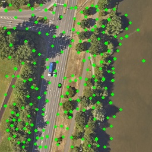
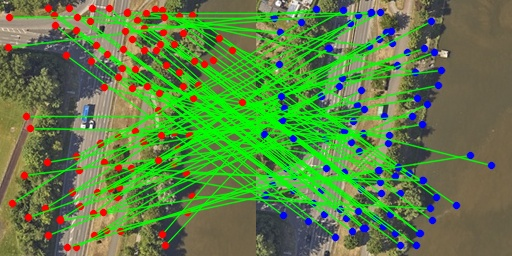

# 在RK1828上使用Rust部署Superpoint+Lightglue

本文记录了在 RK3588 + RK1828 NPU 边缘端平台上，使用 Rust 部署 SuperPoint + LightGlue 的完整流程。涵盖了 C/Rust FFI 封装、针对 NPU 算子的 PyTorch 模型重构、ONNX 导出、RKNN 转换与精度/性能评估，旨在为有边缘端视觉定位/特征匹配部署需求的开发者提供参考。

## 1 编写rknn3的rust ffi

由于rk1828只能使用rknn3-runtime和rknn3-tookkit来进行部署和导出。而官方的rknn3-runtime只有c语言的原始api，因此首先需要对c语言的接口尽心封装，找出我们需要使用的接口并进行一层rust封装即可。

该步骤较为麻烦，且需要详细阅读rknn3的文档和手册。

**我（Ailrid）已经编写完成ffi的封装,对于非LLM的模型推理直接使用即可**，读者可以直接查看[代码仓库](https://github.com/Ailrid/wedjat/tree/master/core/crates/rknn3)。

简而言之，主要结构体的代码如下，仅需三个api即可。不言而喻，流程按照简单的new->run->get_output三步走即可。

```rust
pub struct Rknn3 {
    context: Context,
    input_tensors: Vec<rknn3_tensor>,
    output_tensors: Vec<rknn3_tensor>,
}

impl Rknn3 {
    pub fn new(
        device_id: impl Into<String>,
        model_path: impl Into<String>,
        weight_path: impl Into<String>,
    ) -> Result<Self, RknnError> {
       // ....
    }
    pub fn run<T: Copy>(&mut self, inputs: &[&[T]]) -> Result<(), RknnError> {
       // ....
    }
    #[allow(non_upper_case_globals)]
    pub fn get_output(&self, index: usize) -> Result<Vec<f32>, RknnError> {
       // ....
    }
}
```

## 2 Superpoint

原始的Superpoint接受一个形状为[1,1,H,W]的灰度图像，网络的输出为一个形状为[1,H,W]大小的特征点得分与一个形状为[1,256,H/8,W/8]的256维的特征描述子。在对特征点进行nms处理之后选择真正的局部极大值特征点和特征描述子，其中由于特征描述子的形状只有原图大小的1/8宽高，因此如果要得到某一像素位置的特征描述子，需要对网络的描述子进行插值处理。

rknn的底层算子对于这样的插值处理适配仍然不够好，因此我们要做的第一步就是把所有的后处理（包括特征点的nms处理和特征描述子的插值）从网络中剥离出来。整个网络看起来大概就会变成这样，整体来看结构非常简单，难度不大，

```rust
"""
Copyright (c) 2026-present Ailrid.
Licensed under the Apache License, Version 2.0.
Project: wedjat-metric
"""
import torch
import torch.nn as nn
import torch.nn.functional as F


class SuperPoint(nn.Module):
    """SuperPoint backbone tailored for ONNX and RKNN export."""

    weights_url = "https://github.com/cvg/LightGlue/releases/download/v0.1_arxiv/superpoint_v1.pth"

    def __init__(self, descriptor_dim: int = 256) -> None:
        super().__init__()
        self.descriptor_dim = descriptor_dim

        # Shared encoder
        self.relu = nn.ReLU(inplace=True)
        self.pool = nn.MaxPool2d(kernel_size=2, stride=2)
        c1, c2, c3, c4, c5 = 64, 64, 128, 128, 256

        self.conv1a = nn.Conv2d(1, c1, kernel_size=3, stride=1, padding=1)
        self.conv1b = nn.Conv2d(c1, c1, kernel_size=3, stride=1, padding=1)
        self.conv2a = nn.Conv2d(c1, c2, kernel_size=3, stride=1, padding=1)
        self.conv2b = nn.Conv2d(c2, c2, kernel_size=3, stride=1, padding=1)
        self.conv3a = nn.Conv2d(c2, c3, kernel_size=3, stride=1, padding=1)
        self.conv3b = nn.Conv2d(c3, c3, kernel_size=3, stride=1, padding=1)
        self.conv4a = nn.Conv2d(c3, c4, kernel_size=3, stride=1, padding=1)
        self.conv4b = nn.Conv2d(c4, c4, kernel_size=3, stride=1, padding=1)

        # Detector head
        self.convPa = nn.Conv2d(c4, c5, kernel_size=3, stride=1, padding=1)
        self.convPb = nn.Conv2d(c5, 65, kernel_size=1, stride=1, padding=0)

        # Descriptor head
        self.convDa = nn.Conv2d(c4, c5, kernel_size=3, stride=1, padding=1)
        self.convDb = nn.Conv2d(
            c5, self.descriptor_dim, kernel_size=1, stride=1, padding=0
        )

        # Load pretrained weights
        self.load_state_dict(torch.hub.load_state_dict_from_url(self.weights_url))

    def forward(self, image: torch.Tensor) -> tuple[torch.Tensor, torch.Tensor]:

        x = self.relu(self.conv1a(image))
        x = self.relu(self.conv1b(x))
        x = self.pool(x)
        x = self.relu(self.conv2a(x))
        x = self.relu(self.conv2b(x))
        x = self.pool(x)
        x = self.relu(self.conv3a(x))
        x = self.relu(self.conv3b(x))
        x = self.pool(x)
        x = self.relu(self.conv4a(x))
        x = self.relu(self.conv4b(x))

        # Detector head
        cPa = self.relu(self.convPa(x))
        scores = self.convPb(cPa)
        scores = F.softmax(scores, dim=1)[
            :, :-1
        ]  # Remove dustbin channel (B, 64, H/8, W/8)

        # Reshape to full resolution dense score map (B, 1, H, W)
        b, _, h, w = scores.shape
        s = 8
        scores = (
            scores.reshape(b, s, s, h, w)
            .permute(0, 3, 1, 4, 2)
            .reshape(b, 1, h * s, w * s)
        )

        # Descriptor head
        cDa = self.relu(self.convDa(x))
        descriptors = self.convDb(cDa)
        descriptors = F.normalize(descriptors, p=2, dim=1)  # (B, 256, H/8, W/8)

        return scores, descriptors
```

之后直接导出即可，使用如下代码先导出为ONNX格式。

```python
"""
Copyright (c) 2026-present Ailrid.
Licensed under the Apache License, Version 2.0.
Project: wedjat-metric
"""
def export_superpoint(output_path: str = "superpoint_static.onnx") -> None:
    model = SuperPoint().eval()
    dummy_input = torch.randn(1, 1, 256, 256, dtype=torch.float32)
    torch.onnx.export(
        model,
        dummy_input,  # type: ignore
        output_path,
        export_params=True,
        opset_version=12,
        do_constant_folding=True,
        input_names=["input"],
        output_names=["scores", "descriptors"],
        dynamic_axes=None,
    )

    print(f"Static ONNX model successfully exported to {output_path}")
```

然后安装官方rknn3-toolkit后，使用如下代码可以进行导出和模型评测。这里我们指定目标平台为rk1828，量化模式为w8a8。直接指定单通道即可 mean_values = [[127.5]]，std_values = [[127.5]]。

```python
"""
Copyright (c) 2026-present Ailrid.
Licensed under the Apache License, Version 2.0.
Project: wedjat-rknn
"""

import os
import sys
from rknn.api import RKNN


def init_and_config_rknn(
    target_platform,
    mean_values,
    std_values,
    quantized_dtype="asymmetric_quantized-8",
    quantized_method="channel",
    quantized_algorithm="normal",
):
    """Initialize RKNN object and configure preprocessing parameters."""
    print("--> Initializing and configuring RKNN...")
    rknn = RKNN(verbose=False)
    rknn.config(
        target_platform=target_platform,
        mean_values=mean_values,
        std_values=std_values,
        quantized_dtype=quantized_dtype,
        quantized_method=quantized_method,
        quantized_algorithm=quantized_algorithm,
    )
    return rknn


def load_onnx_model(rknn, path):
    """Load the source ONNX model into RKNN memory."""
    print(f"--> Loading ONNX model from: {path}")
    if not os.path.exists(path):
        print(f"Error: ONNX model file not found at {path}")
        rknn.release()
        sys.exit(-1)

    ret = rknn.load_onnx(model=path)
    if ret != 0:
        print("Error: Load ONNX model failed! Please check model operators.")
        rknn.release()
        sys.exit(ret)


def build_rknn_model(rknn, do_quantization=True, dataset_path=None):
    """Build RKNN model with full quantization or FP16 mode."""
    print(f"--> Building RKNN model (do_quantization={do_quantization})...")
    if do_quantization:
        if not dataset_path or not os.path.exists(dataset_path):
            print(f"Error: Dataset file not found at {dataset_path} for quantization.")
            rknn.release()
            sys.exit(-1)
        ret = rknn.build(do_quantization=True, dataset=dataset_path)
    else:
        ret = rknn.build(do_quantization=False)

    if ret != 0:
        print("Error: Build RKNN model failed!")
        rknn.release()
        sys.exit(ret)
    print("Success: RKNN model built successfully.")


def run_accuracy_analysis_on_folder(rknn, folder_path, output_dir):
    """Scan folder and perform layer-by-layer accuracy analysis using all found images."""
    print(f"--> Scanning folder for test images: {folder_path}")
    if not os.path.isdir(folder_path):
        print(f"Error: Provided path is not a valid directory: {folder_path}")
        rknn.release()
        sys.exit(-1)

    valid_extensions = (
        ".jpg",
        ".jpeg",
        ".png",
        ".bmp",
        ".JPG",
        ".JPEG",
        ".PNG",
        ".BMP",
    )

    image_list = [
        os.path.join(folder_path, f)
        for f in os.listdir(folder_path)
        if f.endswith(valid_extensions)
    ]

    if not image_list:
        print(f"Error: No valid images found in folder: {folder_path}")
        rknn.release()
        sys.exit(-1)

    print(f"--> Found {len(image_list)} images. Starting batch accuracy analysis...")

    ret = rknn.accuracy_analysis(inputs=image_list, output_dir=output_dir, target=None)
    if ret != 0:
        print("Error: Accuracy analysis failed!")
        rknn.release()
        sys.exit(ret)
    print(
        f"Success: Accuracy analysis reports saved to '{output_dir}/error_analysis.txt'"
    )


def export_rknn_model(rknn, path):
    """Export the compiled and verified RKNN model to disk."""
    print(f"--> Exporting RKNN model to: {path}")
    ret = rknn.export_rknn(path)
    if ret != 0:
        print("Error: Export RKNN model failed!")
        rknn.release()
        sys.exit(ret)
    print("Success: Final RKNN model generated successfully.")


def main(
    do_quantization,
    quantized_dtype,
    model_path,
    output_path,
    dataset_path,
    image_folder_path,
    target_platform,
    analysis_output_dir,
    mean_values,
    std_values,
):
    """Execute main flow for RKNN model building."""
    rknn = init_and_config_rknn(
        target_platform=target_platform,
        mean_values=mean_values,
        std_values=std_values,
        quantized_dtype=quantized_dtype,
    )
    try:
        load_onnx_model(rknn, model_path)
        build_rknn_model(
            rknn, do_quantization=do_quantization, dataset_path=dataset_path
        )

        if os.path.exists(image_folder_path):
            run_accuracy_analysis_on_folder(
                rknn, image_folder_path, analysis_output_dir
            )

        export_rknn_model(rknn, output_path)
    except Exception as e:
        print(f"An unexpected error occurred: {e}")
    finally:
        print("--> Releasing RKNN resources...")
        rknn.release()


if __name__ == "__main__":
    do_quantization = True
    quantized_dtype = "w8a8"
    model_path = "assets/superpoint.onnx"
    output_path = "assets/superpoint.rknn"
    dataset_path = "./test_images/dataset.txt"
    image_folder_path = "./test_images"
    target_platform = "rk1828"
    analysis_output_dir = "./snapshot"

    # Single channel configurations for grayscale input
    mean_values = [[127.5]]
    std_values = [[127.5]]

    main(
        do_quantization=do_quantization,
        quantized_dtype=quantized_dtype,
        model_path=model_path,
        output_path=output_path,
        dataset_path=dataset_path,
        image_folder_path=image_folder_path,
        target_platform=target_platform,
        analysis_output_dir=analysis_output_dir,
        mean_values=mean_values,
        std_values=std_values,
    )

```

经过评测，最终量化精度损失控制在1%之内，说明模型量化正常，基本无损失。

```python
layer_name                                                  simulator_error                    
                                                        entire              single             
                                                     cos      euc        cos      euc          
-------------------------------------------------------------------------------------------
[Input] input                                      1.00000 | 0.00000   1.00000 | 0.00000       
[Conv] /conv1a/Conv_output_0                       
[Relu] /relu/Relu_output_0                         0.99797 | 459.11237 0.99797 | 459.11237     
[Conv] /conv1b/Conv_output_0                       
[Relu] /relu_1/Relu_output_0                       0.99490 | 452.73779 0.99803 | 282.21017     
[MaxPool] /pool/MaxPool_output_0                   0.99507 | 290.25031 0.99984 | 50.98222      
[Conv] /conv2a/Conv_output_0                       
[Relu] /relu_2/Relu_output_0                       0.99853 | 180.53827 0.99990 | 47.50360      
[Conv] /conv2b/Conv_output_0                       
[Relu] /relu_3/Relu_output_0                       0.99773 | 234.34865 0.99981 | 68.65708      
[MaxPool] /pool_1/MaxPool_output_0                 0.99795 | 140.77922 0.99995 | 23.36398      
[Conv] /conv3a/Conv_output_0                       
[Relu] /relu_4/Relu_output_0                       0.99786 | 88.88990  0.99979 | 27.82686      
[Conv] /conv3b/Conv_output_0                       
[Relu] /relu_5/Relu_output_0                       0.99850 | 107.51498 0.99980 | 38.89457      
[MaxPool] /pool_2/MaxPool_output_0                 0.99856 | 65.00426  0.99992 | 15.51352      
[Conv] /conv4a/Conv_output_0                       
[Relu] /relu_6/Relu_output_0                       0.99879 | 74.61687  0.99986 | 25.30547      
[Conv] /conv4b/Conv_output_0                       
[Relu] /relu_7/Relu_output_0                       0.99876 | 78.10155  0.99983 | 28.77638      
[Conv] /convPa/Conv_output_0                       
[Relu] /relu_8/Relu_output_0                       0.99623 | 8.14100   0.99942 | 3.13619       
[Conv] /convPb/Conv_output_0                       0.99920 | 117.83292 0.99992 | 32.30668      
[exDataConvert] /convPb/Conv_output_0__float16     0.99920 | 117.83034 0.99996 | 23.88952      
[exSoftmax13] /Transpose_output_0_sw               0.99928 | 1.14666   1.00000 | 0.00470       
[Slice] /Slice_output_0                            0.98124 | 0.77863   1.00000 | 0.00085       
[Reshape] /Reshape_output_0_rs                     0.98124 | 0.77863   1.00000 | 0.00085       
[Transpose] /Transpose_2_output_0-rs               0.98124 | 0.77863   1.00000 | 0.00085       
[Reshape] scores                                   0.98124 | 0.77863   1.00000 | 0.00085       
[Conv] /convDa/Conv_output_0                       
[Relu] /relu_9/Relu_output_0                       0.99874 | 92.35944  0.99989 | 27.17639      
[Conv] /convDb/Conv_output_0                       0.99605 | 4726.699710.99971 | 1295.12781    
[exDataConvert] descriptors                        0.99515 | 3.14969   0.99993 | 0.37416   
```

在rust侧，读者可以查看[仓库](https://github.com/Ailrid/wedjat/blob/master/core/crates/engine/src/superpoint.rs)。

经过测算，**网络的全部的流程，包括输入+推理+输出+后处理，在rk3588+rk1828开发板上，速度大概在57fps左右。**整体来看速度还是偏低，根据测算应该相当的耗时都花在了后处理上，如果要获得更高的速度应该考虑把后处理同样也放在rk1828上运行。

但rk1828能否支持对应的这些后处理算子仍然未知（极大概率不支持），**不建议折腾**，这个帧率绝大多数时候已经足够用了。

```tex
firefly@firefly:~/rknn/crates/engine$ cargo test test_superpoint_pipeline_and_fps --release -- --nocapture

=== Model ./assets/superpoint.rknn Summary ===
=== RKNN IO Summary ===
Input count: 1
Output count: 2

=== Input Tensor Attributes ===
Input [0]:
  Name: input
  Index: 0
  Core ID: 0
  Data Type: 3
  Quantitative Type: 2
  Aligned Size: 65536 bytes
  Element Number: 65536
  Dimensions (n_dims=4): [1, 256, 256, 1]

=== Output Tensor Attributes ===
Output [0]:
  Name: scores
  Index: 0
  Core ID: 0
  Data Type: 1
  Quantitative Type: 0
  Aligned Size: 131072 bytes
  Element Number: 65536
  Dimensions (n_dims=4): [1, 1, 256, 256]
Output [1]:
  Name: descriptors
  Index: 1
  Core ID: 0
  Data Type: 2
  Quantitative Type: 2
  Aligned Size: 262144 bytes
  Element Number: 262144
  Dimensions (n_dims=4): [1, 256, 32, 32]
Extracted 256 keypoints.
Saved visual result to superpoint_result.jpg
--- Benchmark Results ---
Iterations: 100
Average Latency: 17.54 ms
Throughput: 57.03 FPS
test superpoint::tests::test_superpoint_pipeline_and_fps ... ok

test result: ok. 1 passed; 0 failed; 0 ignored; 0 measured; 1 filtered out; finished in 23.02s
```

最后，附上一张提取的特征点结果图，特征点数锁定为256个。



## 3 Lightglue

原始的Lightglue接受一个形状为[2,N,2]的特征点坐标对和一个形状为[2,N,D]的描述子对。然后在其中利用交叉注意力在两个batch之间做交叉注意力。

但是！这个输入格式直接导出时，虽然导出工具不会报错，但是运行时会产生直接导致程序崩溃，产生类似`rknn_outputs_get, msg_finish fail, result = 1(ack_fail), expect 0(ack_succ)!!`这样的错误。

**根据笔者的深入研究，似乎RKNN的硬件底层将不同的batch之间划分为了完全独立的内存块，一旦模型在不同的batch之间进行了运算，直接就会导致npu内部的底层内存布局非法。**

要解决这个问题，我们需要将输入拆分为四个不同的输入，两个形状为[1,N,2]的特征点坐标对和两个形状为[1,N,D]的描述子对，并重构网络，才能正常运行，修改后的代码如下。

```rust
import torch
import torch.nn as nn
import torch.nn.functional as F


class LearnableFourierPositionalEncoding(nn.Module):

    def __init__(
        self, M: int, descriptor_dim: int, num_heads: int, gamma: float = 1.0
    ) -> None:
        super().__init__()
        self.num_heads = num_heads
        head_dim = descriptor_dim // num_heads
        self.Wr = nn.Linear(M, head_dim // 2, bias=False)
        self.gamma = gamma
        nn.init.normal_(self.Wr.weight.data, mean=0, std=self.gamma**-2)

    def forward(self, x: torch.Tensor) -> torch.Tensor:
        """Encode position vector using stack and cat to avoid Tile op on NPU."""
        projected = self.Wr(x)
        cosines, sines = torch.cos(projected), torch.sin(projected)
        emb = torch.stack([cosines, sines])  # Shape: (2, B, N, head_dim // 2)

        # Interleave cosines and sines at the last dimension
        emb = torch.stack([emb, emb], dim=-1).reshape(
            emb.shape[0], emb.shape[1], emb.shape[2], -1
        )  # Shape: (2, B, N, head_dim)

        # Use torch.cat instead of repeat to eliminate ONNX Tile node
        emb = torch.cat([emb] * self.num_heads, dim=-1).unsqueeze(-1)
        return emb


class SelfBlock(nn.Module):
    def __init__(self, embed_dim: int, num_heads: int, bias: bool = True) -> None:
        super().__init__()
        self.embed_dim = embed_dim
        self.num_heads = num_heads
        self.head_dim = embed_dim // num_heads
        self.Wqkv = nn.Linear(embed_dim, 3 * embed_dim, bias=bias)
        self.out_proj = nn.Linear(embed_dim, embed_dim, bias=bias)
        self.ffn = nn.Sequential(
            nn.Linear(2 * embed_dim, 2 * embed_dim),
            nn.LayerNorm(2 * embed_dim, elementwise_affine=True),
            nn.GELU(),
            nn.Linear(2 * embed_dim, embed_dim),
        )

    def rotate_half(self, qk: torch.Tensor) -> torch.Tensor:
        b, n, _, _ = qk.shape
        qk = qk.reshape((b, n, self.num_heads, self.head_dim // 2, 2, 2))
        qk = torch.stack((-qk[..., 1, :], qk[..., 0, :]), dim=4)
        qk = qk.reshape((b, n, self.embed_dim, 2))
        return qk

    def apply_cached_rotary_emb(
        self, encoding: torch.Tensor, qk: torch.Tensor
    ) -> torch.Tensor:
        return qk * encoding[0] + self.rotate_half(qk) * encoding[1]

    def forward(self, x: torch.Tensor, encoding: torch.Tensor) -> torch.Tensor:
        b, n, _ = x.shape
        qkv: torch.Tensor = self.Wqkv(x)
        qkv = qkv.reshape((b, n, self.embed_dim, 3))
        qk, v = qkv[..., :2], qkv[..., 2]
        qk = self.apply_cached_rotary_emb(encoding, qk)
        q, k = qk[..., 0], qk[..., 1]

        head_dim = self.embed_dim // self.num_heads
        q = q.reshape(b, n, self.num_heads, head_dim).transpose(1, 2)
        k = k.reshape(b, n, self.num_heads, head_dim).transpose(1, 2)
        v = v.reshape(b, n, self.num_heads, head_dim).transpose(1, 2)

        context = (
            F.scaled_dot_product_attention(q, k, v)
            .transpose(1, 2)
            .reshape(b, n, self.embed_dim)
        )
        message = self.out_proj(context)
        return x + self.ffn(torch.cat([x, message], dim=2))


class CrossBlock(nn.Module):
    def __init__(self, embed_dim: int, num_heads: int, bias: bool = True) -> None:
        super().__init__()
        self.embed_dim = embed_dim
        self.num_heads = num_heads
        self.head_dim = embed_dim // num_heads
        self.to_qk = nn.Linear(embed_dim, embed_dim, bias=bias)
        self.to_v = nn.Linear(embed_dim, embed_dim, bias=bias)
        self.to_out = nn.Linear(embed_dim, embed_dim, bias=bias)
        self.ffn = nn.Sequential(
            nn.Linear(2 * embed_dim, 2 * embed_dim),
            nn.LayerNorm(2 * embed_dim, elementwise_affine=True),
            nn.GELU(),
            nn.Linear(2 * embed_dim, embed_dim),
        )

    def forward(
        self, desc0: torch.Tensor, desc1: torch.Tensor
    ) -> tuple[torch.Tensor, torch.Tensor]:
        """Cross attention between two independent image descriptor streams."""
        num_keypoints = desc0.shape[1]
        qk0, v0 = self.to_qk(desc0), self.to_v(desc0)
        qk1, v1 = self.to_qk(desc1), self.to_v(desc1)

        head_dim = self.embed_dim // self.num_heads

        # Stream 0 attends to Stream 1
        q0 = qk0.reshape(1, num_keypoints, self.num_heads, head_dim).transpose(1, 2)
        k1 = qk1.reshape(1, num_keypoints, self.num_heads, head_dim).transpose(1, 2)
        v1_heads = v1.reshape(1, num_keypoints, self.num_heads, head_dim).transpose(
            1, 2
        )

        m0 = (
            F.scaled_dot_product_attention(q0, k1, v1_heads)
            .transpose(1, 2)
            .reshape(1, num_keypoints, self.embed_dim)
        )
        m0 = self.to_out(m0)
        desc0_out = desc0 + self.ffn(torch.cat([desc0, m0], dim=2))

        # Stream 1 attends to Stream 0
        q1 = qk1.reshape(1, num_keypoints, self.num_heads, head_dim).transpose(1, 2)
        k0 = qk0.reshape(1, num_keypoints, self.num_heads, head_dim).transpose(1, 2)
        v0_heads = v0.reshape(1, num_keypoints, self.num_heads, head_dim).transpose(
            1, 2
        )

        m1 = (
            F.scaled_dot_product_attention(q1, k0, v0_heads)
            .transpose(1, 2)
            .reshape(1, num_keypoints, self.embed_dim)
        )
        m1 = self.to_out(m1)
        desc1_out = desc1 + self.ffn(torch.cat([desc1, m1], dim=2))

        return desc0_out, desc1_out


class TransformerLayer(nn.Module):
    def __init__(self, embed_dim: int, num_heads: int) -> None:
        super().__init__()
        self.self_attn = SelfBlock(embed_dim, num_heads)
        self.cross_attn = CrossBlock(embed_dim, num_heads)

    def forward(
        self,
        desc0: torch.Tensor,
        desc1: torch.Tensor,
        enc0: torch.Tensor,
        enc1: torch.Tensor,
    ) -> tuple[torch.Tensor, torch.Tensor]:
        desc0 = self.self_attn(desc0, enc0)
        desc1 = self.self_attn(desc1, enc1)
        desc0, desc1 = self.cross_attn(desc0, desc1)
        return desc0, desc1


def sigmoid_log_double_softmax_static(
    similarities: torch.Tensor, z0: torch.Tensor, z1: torch.Tensor
) -> torch.Tensor:
    """Compute assignment matrix without log operations."""
    scores0 = F.softmax(similarities, dim=2)
    scores1 = F.softmax(similarities, dim=1)
    certainties = torch.sigmoid(z0) * torch.sigmoid(z1).transpose(1, 2)
    return scores0 * scores1 * certainties


class MatchAssignmentStatic(nn.Module):
    def __init__(self, dim: int) -> None:
        super().__init__()
        self.scale = dim**0.25
        self.final_proj = nn.Linear(dim, dim, bias=True)
        self.matchability = nn.Linear(dim, 1, bias=True)

    def forward(self, desc0: torch.Tensor, desc1: torch.Tensor) -> torch.Tensor:
        """Build assignment matrix directly from stream inputs."""
        mdesc0 = self.final_proj(desc0) / self.scale
        mdesc1 = self.final_proj(desc1) / self.scale

        similarities = mdesc0 @ mdesc1.transpose(1, 2)

        z0 = self.matchability(desc0)
        z1 = self.matchability(desc1)

        scores = sigmoid_log_double_softmax_static(similarities, z0, z1)
        return scores


class LightGlue(nn.Module):
    def __init__(
        self,
        url: str = "https://github.com/cvg/LightGlue/releases/download/v0.1_arxiv/superpoint_lightglue.pth",
        input_dim: int = 256,
        descriptor_dim: int = 256,
        num_heads: int = 4,
        n_layers: int = 9,
    ) -> None:
        super().__init__()

        self.descriptor_dim = descriptor_dim
        self.num_heads = num_heads
        self.n_layers = n_layers

        if input_dim != self.descriptor_dim:
            self.input_proj = nn.Linear(input_dim, self.descriptor_dim, bias=True)
        else:
            self.input_proj = nn.Identity()

        self.posenc = LearnableFourierPositionalEncoding(
            2, self.descriptor_dim, self.num_heads
        )

        d, h, n = self.descriptor_dim, self.num_heads, self.n_layers
        self.transformers = nn.ModuleList([TransformerLayer(d, h) for _ in range(n)])
        self.log_assignment = nn.ModuleList(
            [MatchAssignmentStatic(d) for _ in range(n)]
        )

        # Load weights directly without structural mismatch
        state_dict = torch.hub.load_state_dict_from_url(url)
        for i in range(n):
            pattern = f"self_attn.{i}", f"transformers.{i}.self_attn"
            state_dict = {k.replace(*pattern): v for k, v in state_dict.items()}
            pattern = f"cross_attn.{i}", f"transformers.{i}.cross_attn"
            state_dict = {k.replace(*pattern): v for k, v in state_dict.items()}
        self.load_state_dict(state_dict, strict=False)

    def forward(
        self,
        kpts0: torch.Tensor,  # Shape: (1, N, 2)
        kpts1: torch.Tensor,  # Shape: (1, N, 2)
        descs0: torch.Tensor,  # Shape: (1, N, 256)
        descs1: torch.Tensor,  # Shape: (1, N, 256)
    ) -> torch.Tensor:
        """Forward pass taking 4 independent inputs with batch size 1."""
        descs0 = self.input_proj(descs0)
        descs1 = self.input_proj(descs1)

        enc0 = self.posenc(kpts0)
        enc1 = self.posenc(kpts1)

        for i in range(self.n_layers):
            descs0, descs1 = self.transformers[i](descs0, descs1, enc0, enc1)

        scores = self.log_assignment[-1](descs0, descs1)
        return scores
```

使用以下代码进行导出，由于lightglue里含有大量transformer块，所以我们这里使用fp16格式导出。

```python
"""
Copyright (c) 2026-present Ailrid.
Licensed under the Apache License, Version 2.0.
Project: wedjat-rknn
"""

import osv
import sys
from rknn.api import RKNN


def convert_onnx_to_rknn_fp16(
    onnx_path,
    rknn_path,
    target_platform="rk3588",
    quantized_dtype="w8a8",
    quantized_method="channel",
    quantized_algorithm="normal",
):
    """Convert LightGlue ONNX model to pure FP16 RKNN model."""
    rknn = RKNN(verbose=False)

    print(f"--> Configuring RKNN for FP16 ({target_platform})...")
    # For non-image inputs, mean_values and std_values should be None
    rknn.config(
        target_platform=target_platform,
        mean_values=None,
        std_values=None,
        quantized_dtype=quantized_dtype,
        quantized_method=quantized_method,
        quantized_algorithm=quantized_algorithm,
    )

    print(f"--> Loading ONNX model from {onnx_path}...")
    if not os.path.exists(onnx_path):
        print(f"Error: ONNX model file not found at {onnx_path}")
        sys.exit(-1)

    ret = rknn.load_onnx(model=onnx_path)
    if ret != 0:
        print("Error: Load ONNX model failed!")
        rknn.release()
        sys.exit(ret)

    print("--> Building RKNN model with FP16 (do_quantization=False)...")
    # Setting do_quantization=False forces the NPU to use FP16 precision
    ret = rknn.build(do_quantization=False)
    if ret != 0:
        print("Error: Build FP16 RKNN model failed!")
        rknn.release()
        sys.exit(ret)

    print(f"--> Exporting RKNN model to {rknn_path}...")
    ret = rknn.export_rknn(rknn_path)
    if ret != 0:
        print("Error: Export RKNN model failed!")
        rknn.release()
        sys.exit(ret)

    print("Success: FP16 RKNN model created successfully.")
    rknn.release()


if __name__ == "__main__":
    onnx_file = "assets/lightglue.onnx"
    rknn_file = "assets/lightglue.rknn"
    platform = "rk1828"  # 'rk3588', 'rk1828'

    convert_onnx_to_rknn_fp16(
        onnx_path=onnx_file,
        rknn_path=rknn_file,
        target_platform=platform,
    )
```

在rust侧推理代码，读者可以查看[仓库](https://github.com/Ailrid/wedjat/blob/master/core/crates/engine/src/lightglue.rs)。

经过测算，**网络的全部的流程，包括输入+推理+输出+后处理，在rk3588+rk1828开发板上，速度大概在17fps左右。**整体来看速度好像其实还不错？毕竟是fp16进行的量化。

**如果要获得更高的速度应该考虑采用混合量化，但rknn3将此过程单独分离到了一个工具中，目前笔者暂无研究，等待以后补充。**

```tex
firefly@firefly:~/rknn/crates/engine$ cargo test test_superpoint_lightglue_pipeline --release -- --nocapture 

W RKNNAPI(3948): Weight sync chunk size resolved to 2097152 bytes
=== Model ./assets/superpoint.rknn Summary ===
=== RKNN IO Summary ===
Input count: 1
Output count: 2

=== Input Tensor Attributes ===
Input [0]:
  Name: input
  Index: 0
  Core ID: 0
  Data Type: 3
  Quantitative Type: 2
  Aligned Size: 65536 bytes
  Element Number: 65536
  Dimensions (n_dims=4): [1, 256, 256, 1]

=== Output Tensor Attributes ===
Output [0]:
  Name: scores
  Index: 0
  Core ID: 0
  Data Type: 1
  Quantitative Type: 0
  Aligned Size: 131072 bytes
  Element Number: 65536
  Dimensions (n_dims=4): [1, 1, 256, 256]
Output [1]:
  Name: descriptors
  Index: 1
  Core ID: 0
  Data Type: 2
  Quantitative Type: 2
  Aligned Size: 262144 bytes
  Element Number: 262144
  Dimensions (n_dims=4): [1, 256, 32, 32]
Device 0: 0000:01:00.0
=== Model ./assets/lightglue.rknn Summary ===
=== RKNN IO Summary ===
Input count: 4
Output count: 1

=== Input Tensor Attributes ===
Input [0]:
  Name: keypoints0
  Index: 0
  Core ID: 0
  Data Type: 1
  Quantitative Type: 0
  Aligned Size: 1024 bytes
  Element Number: 512
  Dimensions (n_dims=3): [1, 256, 2]
Input [1]:
  Name: keypoints1
  Index: 1
  Core ID: 0
  Data Type: 1
  Quantitative Type: 0
  Aligned Size: 1024 bytes
  Element Number: 512
  Dimensions (n_dims=3): [1, 256, 2]
Input [2]:
  Name: descriptors0
  Index: 2
  Core ID: 0
  Data Type: 1
  Quantitative Type: 0
  Aligned Size: 131072 bytes
  Element Number: 65536
  Dimensions (n_dims=3): [1, 256, 256]
Input [3]:
  Name: descriptors1
  Index: 3
  Core ID: 0
  Data Type: 1
  Quantitative Type: 0
  Aligned Size: 131072 bytes
  Element Number: 65536
  Dimensions (n_dims=3): [1, 256, 256]

=== Output Tensor Attributes ===
Output [0]:
  Name: scores
  Index: 0
  Core ID: 0
  Data Type: 1
  Quantitative Type: 0
  Aligned Size: 131072 bytes
  Element Number: 65536
  Dimensions (n_dims=3): [1, 256, 256]
SuperPoint extracted 256 and 256 keypoints.
Found 97 valid matches.
--- LightGlue Benchmark Results ---
Iterations: 100
Average Latency: 59.01 ms
Throughput: 16.95 FPS
Saved match visualization to lightglue_matches.jpg
test lightglue::integration_tests::test_superpoint_lightglue_pipeline ... ok
```

最后，附上一张superpoint提取 + lightglue匹配的结果图，特征点数量为256个。



---

补充：经过笔者评测，使用RKQuantizer进行混合量化后，速度提升微乎其微几乎可以忽略不计。使用int8量化后精度损失严重，匹配结果几乎不可用。因此可以得出结论，lightglue不适合进行量化，使用fp16进行推理即可。

再次补充：根据我的测试，不同的开发板型号和不同的1828封装会导致性能出现差异，有些开发板上可能速度略低或更高一些（superpoint浮动在10fps，lightglue在2-5fps内），但总体来说不会差异太多。

## 4 总结

读者可以查看完整的代码仓库，该步骤为笔者的完整的[地图匹配定位项目](https://github.com/Ailrid/wedjat/tree/master)的一部分。以上代码均摘自该项目。

以上，至此。
