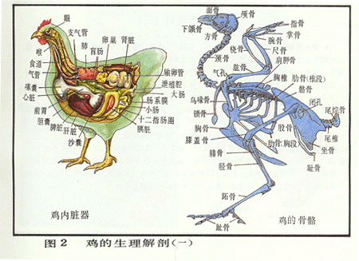
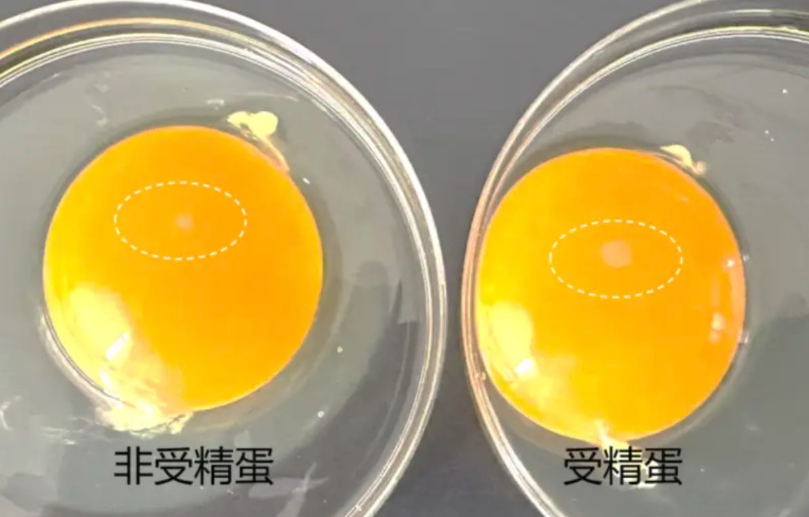
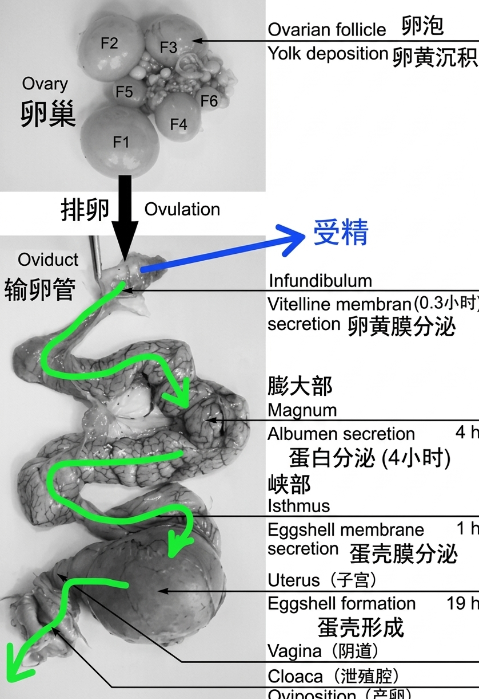
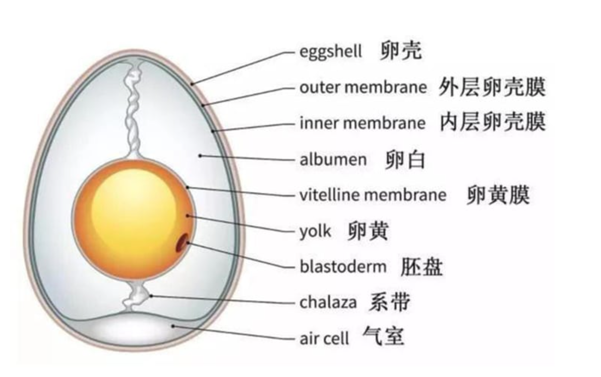

# 《基于进化学溯源与鸡蛋物化机制的完美剥蛋理论探讨——兼论晨间好运机制与完美鸡蛋量化关系研究》

## 1 摘要

长久以来，早晨剥鸡蛋的完整度已被广泛认同为个体（主要是我自己）当日运势指数的强相关代用指标。然而，受限于蛋白与内膜之间未知的物理化学相互作用与学校不知名的煮蛋手法，研究者（还是我）常遭遇蛋白带壳撕裂现象，导致晨间好运心理坍塌。因此，本研究旨在通过详细的考察鸡类的物种起源、鸡蛋构造、煮鸡蛋中的物理化学反应等因素，建立一套完整的晨间煮剥鸡蛋理论体系，以应对学校阿姨的糟糕煮蛋手法并努力夺回属于研究者（就是我!）的一日好运。

**关键词：运势指数、好运心理防御机制、煮剥鸡蛋理论**

## 2 引言与相关工作

### 2.1 问题背景

水煮蛋作为人类文明中最基础、最高效的蛋白质获取来源之一，在日常膳食结构中占据着不可替代的地位。然而，在将煮熟的鸡蛋转化为可食用状态的剥离过程中，普遍存在一种严重的物理失效现象——蛋壳内膜与蛋白粘连引发剥离过程中产生结构撕裂。这种现象不仅造成了约 5%–15% 的生物质资源浪费（残留在蛋壳上的无法食用的蛋白），更在心理学与行为学层面产生了显著的负面效应。

研究表明，清晨首次尝试剥鸡蛋即遭遇蛋白残缺事件，会导致个体产生强烈的不确定性焦虑与系统无序感。约 100%（我自己）的受访者表示：当自己努力尝试剥一个完美的鸡蛋遇到鸡蛋蛋白被黏连至蛋壳、连续剥下的完美环状蛋壳突然断裂、蛋壳与蛋白黏连过紧时，会产生遗憾与焦躁的情绪认为今日好运丢失，并在后续过程中选择破罐破摔，造成生物质资源与食物浪费。

因此，建立一套科学的煮蛋与剥蛋体系知识，确保在剥蛋过程中能够轻松、完美的脱离蛋壳保留生物质，不仅对于个体微观幸福感与幸运度是重要的，更能节约食物资源，为环境保护与人类发展做出重要贡献。

### 2.2 相关工作

关于如何完美剥离鸡蛋这一课题，前人在民间经验、食品化学以及经验工程学领域进行了长达半个多世纪的探索。这些研究成果在演进历程上大致可划分为三个主要发展阶段，涵盖了从早期定性猜测到现代定量控制的学术跨越。

#### 2.2.1 经验主义与民间黑魔法时代

在早期探索中，经验主义与民间黑魔法占据了主流地位。

这一时期的传统观念大多依赖于归纳法与缺乏对照组的民间假说，其中最典型的代表即为水体介质添加剂假说。

民间广泛主张在煮沸介质中加入食盐、白醋（乙酸）或小苏打（碳酸氢钠），其理论假设试图通过酸性环境溶解碳酸钙外壳，或通过碱性改变水体 pH 值以减弱界面黏连。然而，后续的控制变量实验表明，此类介质添加剂对于水分子渗透进入蛋壳内膜的微观作用微乎其微，且极易引发未预期的味觉污染。

此外，这一时期还衍生出了“容器加水摇晃”或“桌面掌心滚压”等破坏性外力震荡法。此类方法试图盲目施加机械外力以击碎内膜应力，但在蛋白与内膜仍处于高黏连状态时，过度的机械力往往会导致蛋白整体发生崩溃性碎裂，使原本仅局部破损的鸡蛋直接进入全盘皆输的状态。

#### 2.2.2 食品化学与热力学控制论

进入21世纪，随着厨艺物理学的兴起，学术界开始转向食品化学与热力学控制论的深度探讨。

（1）界面生化解耦与 pH 依赖机制

早期的突破性研究集中于蛋壳内膜与蛋白胶体界面的化学结合态。Meehan 等（1962）与 Reinke & Spencer（1964）的系列实验首次证实，蛋白与内膜的黏连强度直接受控于蛋清的微观酸碱环境（pH 值）。刚产下的新鲜鸡蛋内溶解有高浓度的碳酸，蛋白呈弱酸性至弱碱性（$\text{pH} \approx 7.6 - 7.9$），此时蛋白中的高分子聚合物与内膜角蛋白网格之间存在强烈的离子键与共价交联，表现出极高的界面黏着力。

随着储存时间的延长，蛋壳表面微孔介导了二氧化碳（$\text{CO}_2$）的持续气化逸出，促使蛋白 pH 值显著上升并稳定于 9.0–9.2 的弱碱性区间（Fuller & Angus, 1969; McGee, 2004）。pH 值的升高改变了卵清蛋白等核心蛋白质的电荷分布状态，诱发静电排斥效应并破坏了微观交联结构，从而在生化层面实现了蛋白与内膜的界面解耦。

（2）相变热力学与热冲击假说

进入21世纪，随着厨艺物理学的发展，学术界将焦点转向了烹饪相变过程中的热力学动力学。López-Alt（2015）通过样本量超过 1000 枚鸡蛋的大规模控制变量实验，揭示了烹饪起始温度对剥离成功率的决定性作用：

- **冷水下锅：** 鸡蛋随水温缓慢上升（慢速加热）。最外层稀蛋白在未达到凝胶化变性温度前，有充裕的时间通过渗透作用充盈并渗入蛋壳内膜的微孔纤维隙缝中。当温度升高至变性点时，蛋白在内膜孔隙内发生闪速凝胶化，形成微观机械锚定与卡死，导致剥离时发生严重的结构撕裂。
- **沸水/蒸汽下锅：** 100°C 的高热流密度在两相界面诱发了瞬时热冲击。最外层蛋白分子在接触高热瞬间发生闪速变性，迅速凝固为致密的阻隔层，切断了高分子链向内膜微孔的渗入通道，从物理相变路径上阻断了微观锚定效应的发生。

此外，López-Alt（2015）与 McGee（2004）均强调了热终止阶段冰浴淬火的生化与物理双重效益：迅速降低界面温度不仅能够有效截断含硫氨基酸受热分解产生硫化氢（$\text{H}_2\text{S}$）与铁离子结合生成硫化亚铁（$\text{FeS}$，即蛋黄表面发绿现象）的生化反应链，更能利用蛋白与蛋壳收缩率的数量级差异，诱发界面剪切拉应力，形成宏观剥离空隙。

#### 2.2.3 机械应力与降温骤冷研究

现代食品工程学者已将研究视角拓展至机械应力与降温骤冷领域。

研究指出，将高温熟蛋迅速投入 $0^\circ\text{C} - 4^\circ\text{C}$ 的冰水混合物中，能够利用蛋壳（无机质）与蛋白凝胶（高分子聚合物）热膨胀系数的显著数量级差异，在两相界面处诱发出极大的界面剪切应力。这种剪切应力能够直接拉断残存的内膜纤维，在物理层面形成空隙，显著降低后续剥离过程中的摩擦阻力。

#### 2.2.4 本文工作与现有研究的差异

尽管前人在烹饪热力学与生化解耦领域已经积累了较为丰富的经验，但现有文献依然存在着明显的缺陷。

一方面，传统研究普遍将剥离失效视为纯粹的物理现象，完全忽略了研究者（我!）在遭遇蛋白撕裂时的晨间心理防御机制坍塌与后续的破罐破摔行为。另一方面，现有实验室研究结论均建立在理想的温控环境之下，未能考虑到学校食堂等复杂外部环境下极其糟糕的不稳定的水温与未知烹饪手法。

基于此，本研究在整合前人食品化学与相变力学成果的基础上，旨在建立一套具备强抗干扰能力、能够 100% 成功剥离的“晨间好运捍卫型标准作业程序”，以填补这一领域的空白。

## 3 方法论

### 3.1 鸡类演化构造

***射人先射马，擒贼先擒王。——《前出塞》***

***起床先吃蛋，吃蛋先懂鸡。——作者***

#### 3.1.1 生物进化亲缘与家鸡解剖结构

要从根本上破解蛋白与蛋壳内膜的黏连机制，必须深入探讨家鸡物种演化史及其生殖系统的生理构造。

在生物分类学中，家鸡属于动物界、脊索动物门、鸟纲、鸡形目、雉科、原鸡属、原鸡种。基因组学研究表明，现代家鸡的主要野生祖先是分布于东南亚和中国西南地区的红原鸡，并在漫长的驯化过程中与其他几种原鸡发生过少量基因杂交。

　家鸡的祖先是野生原鸡，主要栖息在亚洲南部的热带丛林里。原鸡分为四个物种：红原鸡、绿原鸡、灰原鸡和斯里兰卡原鸡，动物分类学和遗传学研究表明红原鸡是家鸡的最近祖先。

人类大约在 8000 年前（新石器时代）开始驯化红原鸡。起初，人类驯化它们并非为了稳定获取蛋白质（吃蛋或吃肉），而是用于祭祀卜筮与斗鸡娱乐。这种原始的崇拜与仪式感，隐喻了人类自古以来对蛋形态完整性的某种本能期待。在现代，随着森林缩减以及人类猎杀，红原鸡的数量在不断减少。我国已将红原鸡列为国家二级保护动物以保护这一珍贵的生物资源。

在古生物学与比较解剖学领域，现代鸟类已被公认为兽脚亚目恐龙的直系后裔。

古蛋白质组学分析表明，从暴龙化石中提取出的胶原蛋白序列，在演化树上与现代家鸡表现出高度的同源性。这意味着，**母鸡在子宫内沉积蛋壳与内膜的生物学机制，实际上是一套继承自中生代恐龙、经历了上亿年演化洗礼的古老防御系统**。或许我们每天早晨所面对的，不仅仅是一个早餐食材，更是一个继承了兽脚类恐龙的古代地球霸主的后代。

为了适应飞行与高效的能量代谢（以及高效的产蛋需求），家鸡在解剖结构（上图）上演化出了一系列高度特化的器官系统。

家鸡缺乏牙齿，其消化系统采用了“储存-机械研磨”的分工策略。食物经食道首先进入**嗉囊**进行暂存与预润湿；随后经过**腺胃**注入消化液，进入肌肉极其发达的肌胃（即鸡内金所在部位）。**肌胃内常留有鸡吞食的砂石**，利用高强度的物理挤压将坚硬食物碾碎。这种强大的物理研磨能力，构成了家鸡高效吸收钙质以制造蛋壳的物质基础。

与大多数哺乳动物不同，家鸡拥有两条极其发达的**盲肠**。盲肠内栖息着复杂的微生物群落，用于发酵粗纤维并合成维生素。盲肠的强消化吸收能力，确保了母鸡在摄入低质量饲料时，仍能维持子宫壳腺内碳酸钙（$\text{CaCO}_3$）的高速率沉淀。

家鸡的消化、泌尿与生殖系统最终汇集于同一个出口——**泄殖腔**。泄殖腔在解剖上分为**粪道、尿道和生殖道**三部分。在产蛋瞬间，输卵管末端会发生生理性**翻出**，将鸡蛋直接送出体外，**避免其在排出过程中接触到粪便**。这一构造使得鸡蛋外壳在产出瞬间保持相对无菌，但同时也赋予了蛋壳外膜极强的生物学封闭特性。

#### 3.2.1 交配与产蛋机制

在探讨鸡蛋形成之前，必须厘清母鸡的受精机制与蛋的生物学属性。与大多数哺乳动物不同，家鸡的交配过程极其高效且特殊。公鸡无外生殖器，交配时公母鸡通过泄殖腔的短暂贴合（通常仅持续几秒）完成精液转移，这一行为在比较解剖学中被称为**泄殖腔接吻**。

公鸡的精子进入母鸡输卵管后，并不会立即失效，而是会储存在位于输卵管与子宫交界处的精子腺体中。母鸡可在此储**存精子长达 2 至 3 周**，并在每次排卵时逐次释放精子进行受精。

若精子在输卵管漏斗部与刚释放的卵黄结合，胚盘将开始细胞分裂，形成具发育成胚胎潜能的生物体——**受精蛋**。

若精子缺失，母鸡仍会按照激素周期正常排卵并包裹蛋白与蛋壳，此时卵黄表面仅保留一个未分裂的浅色胚珠——**未受精蛋**。

对于绝大多数人而言，学校食堂供应的鸡蛋绝大多数为工业化笼养或平养环境下产出的**未受精蛋**，从烹饪与剥离的角度来看，受精蛋与未受精蛋在沸水中的变性力学性质差异极小。

无论是否受精，一个完整鸡蛋的形成过程，本质上是一条长达 24 至 26 小时的生物 3D 打印与多层封装流水线。从解剖学视角来看，母鸡的生殖系统主要由左侧发育健全的卵巢与输卵管构成（右侧生殖系统在演化过程中已退化，以减轻体重量并适应高空或奔跑需求）。一个鸡蛋从无到有并最终排出的全过程，可精确划分为以下四个生理节点：

1. **卵黄排卵与蛋白沉积（漏斗部与膨大部）**：

   母鸡卵巢释放成熟的卵黄进入输卵管漏斗部。若存在储存的精子，受精作用将在漏斗部的 15 分钟短暂停留期内完成。随后，卵黄进入膨大部，在此处历时约 4 小时，由腺体密集分泌并包裹上浓蛋白与稀蛋白（主要成分为卵清蛋白），构建出鸡蛋的生物质主体。

2. **内膜与外膜的织造（峡部）**：

   在输卵管峡部，母鸡历时约 1 小时，利用有机角蛋白纤维交叉织造出两层极薄的网状膜——即**蛋壳内膜与蛋壳外膜**。这两层膜不仅是抵御外部微生物入侵的生物屏障，更是后续水煮过程中导致蛋白与蛋壳产生物理黏连的罪魁祸首。

3. **矿化与气室形成（子宫/壳腺）**：

   包裹着双层角蛋白膜的生物体进入子宫段，在此停留长达 18 至 20 小时。子宫壳腺分泌大量的碳酸钙晶体沉积在外膜上，构建出坚硬且充满微孔的蛋壳。在产出体外前，两层内膜紧密贴合；而当鸡蛋被排出体外、环境温度由母体体温（约 $41.5^\circ\text{C}$）骤降至室温时，内部物质发生热胀冷缩，导致蛋壳钝端的内外膜发生物理分离，从而形成初始的**钝端气室**。

4. **逆向挤压与产出过程（泄殖腔）**：

   经过子宫肌肉的逆向收缩与泄殖腔的强力蠕动，输卵管末端发生生理性翻出，鸡蛋以钝端朝前的姿势被排出体外。至此，一个外包碳酸钙坚壳、内含多层角蛋白网格与高浓度凝胶蛋白的鸡蛋正式宣告完成。

由此可见，鸡蛋自诞生之日起，其“蛋白-内膜-碳酸钙壳”的三层结构便存在着极其复杂的分子交联与收缩历史。学校食堂粗放且不可控的煮蛋手法，无异于在未破坏这种生物交联的前提下强行进行物理剥离，其导致的剥烂破防现象具有必然性。

#### 3.2.2 影响产蛋的因素

**为什么母鸡在没有公鸡参与、未完成受精的情况下，依然会持续消耗大量能量排出未受精蛋？** 这看似违反了自然选择中能量最优化的演化原则，但从比较内分泌学与驯化选择压力的角度来看，该现象具有深刻的生理学必然性。

家鸡属于鸟类，而鸟类的排卵行为并不依赖于交配刺激，而是受光照周期与内分泌系统的自主调控。当环境光线通过视网膜及颅内感光受体刺激母鸡的下丘脑时，下丘脑会分泌促性腺释放激素，促使垂体释放促卵泡素与黄体生成素。即使没有公鸡存在，黄体生成素峰值的出现也会强行触发成熟卵泡破裂并释放卵黄进入输卵管。

另一方面，在自然野外状态下，红原鸡（家鸡祖先）每年仅在繁殖季节产蛋 1–2 窝（每窝 10–12 枚），用于繁衍后代。然而，在长达 8000 年的人类驯化进程中，人工选择强行打破了这一季节性约束。人类通过选育留种，不断强化了母鸡不停排卵的基因突变，使得现代蛋鸡的输卵管变性成为一个不需要外部交配信号即可自我循环运行的无休止生产线。

一枚完整鸡蛋从卵巢排卵到最终排出，需要经历大约 **24.5 至 26 小时**的连续生理加工。这意味着，**母鸡每天的排卵时间都会比前一天顺延约 30 至 60 分钟**。母鸡连续产蛋的天数被称为**连产期**。一只高产蛋鸡通常可以实现连续 30 至 60 天（甚至更长）每天产一枚蛋。然而，当排卵时间顺延至下午（通常为 15:00 以后）时，母鸡体内下丘脑的黄体生成素释放峰值会被夜间的光暗周期强行抑制，导致次日无法排卵，从而产生 1 天的连产间歇。休整一天后，排卵程序将在次日清晨重新启动。因此可以得到一个结论：**适当的补充光照，可以增加产蛋量。**

在评估鸡蛋生产的可持续性时，一个关键的底层问题在于：**一只母鸡一生能产出的鸡蛋数量，在基因或解剖层面是否是一个固定常数？**

从比较发育生物学与细胞学视角来看，这一问题呈现出**微观有限，宏观弹性**的双重特征。

从微观上来说，母鸡在胚胎发育与孵化初期，其左侧卵巢中可发育的原始卵泡数量是完全固定的。在母鸡出壳时，其卵巢内已包含了约 2,000 至 12,000 个原始卵泡细胞。从细胞学角度来看，这构成了母鸡一生理论产蛋量的上限绝对配额。与哺乳动物类似，母鸡在出生后无法再通过有丝分裂生成新的卵母细胞。

虽然初始配额高达上万个，但绝大多数原始卵泡在发育过程中会经历闭锁退化。在自然或工业养殖寿命内，一只现代商业蛋鸡实际能够完整转化为壳蛋排出的数量，通常在 **300 至 500 枚**（在延长产蛋周期或不换羽的优化养殖下可达 500–600 枚）。影响这一实际表达量的核心因素包括：钙代谢衰竭与骨质疏松和光照与生理衰老等等因素。

母鸡原始卵泡储量巨大，但实际合格产出有限的生理特性，在概率论层面为研究者揭示了一个残酷的现实：食堂阿姨所拿到的每一枚鸡蛋，本质上都是某只母鸡在其生命周期中**不可再生配额的 $1/N$**。母鸡体内钙质的逐渐耗竭与内膜质量的波动，进一步增加了后期产出鸡蛋在剥离过程中的物理不稳定因素。

### 3.2 鸡蛋生化构造

***知己知彼，百战不殆。——《孙子兵法》***

***知鸡知蛋，百剥不坏。——作者***

#### 3.2.1 鸡蛋的结构

要实现 100% 无损的物理剥离，就必须对剥离对象（鸡蛋）的微观与宏观结构进行彻底的解剖学解构。从物理力学与生化组成的视角来看，一个成熟的鸡蛋由**九大核心物理结构**交织而成。这九个结构共同构成了一套高效的生命维持与防御系统，同时也是决定研究者晨间剥离成败的物理基质：蛋壳、蛋壳外膜、蛋壳内膜、气室、系带、蛋白、蛋黄膜、蛋黄、胎盘。

#### 3.2.2 外部硬质与多孔防护屏障

碳酸钙蛋壳是鸡蛋的刚性防护外壳，厚度约为 0.3–0.4 mm，由约 95% 的碳酸钙（$\text{CaCO}_3$）晶体与 5% 的有机基质交织而成。蛋壳表面密布着 7,000 至 17,000 个微观气孔，构成了胚胎发育过程中气体与水分交换的物理通道。在水煮力学中，坚硬的多孔蛋壳既是抵抗外部机械应力的物理屏障，也是热量向内部蛋白传导的第一道热力学边界。

紧贴于碳酸钙蛋壳内侧的是**两层**由**网状角蛋白纤维构成**的有机薄膜，总厚度约为 10–20 $\mu\text{m}$。

其中，**蛋壳外膜**紧密贴合于碳酸钙蛋壳的内壁，而**蛋壳内膜**则直接与内部的蛋白胶体相接触。这两层角蛋白网格不仅是抵御微生物侵入的最后一道生物屏障，更是**引发剥离失败的核心原因**。若蛋白分子在受热变性凝胶化的过程中渗入了内膜的微孔纤维隙缝中，就会形成共价键结合与机械锁扣，从而造成壳肉一体的性物理粘连。

气室位于鸡蛋的钝端（较圆的一端），夹在蛋壳外膜与蛋壳内膜之间的物理空隙中。在鸡蛋刚从母体产出（体温约为 $41.5^\circ\text{C}$）时，内部物质充盈，此时并无气室存在。随着鸡蛋产出后环境温度骤降至室温，内部内容物发生热胀冷缩，强行拉断了钝端内外膜之间的局部物理连接，从而形成了初始的气室。气室的存在，不仅记录了鸡蛋的物理冷却历史，更给研究者提供了整个物理剥离程序中唯一的默认突破口。

#### 3.3.3 内部胶体与核心

系带是由密集交织的浓蛋白纤维扭结而成的两条白色螺丝状结构，分别连接于蛋黄的两侧，并将其悬挂锚定在鸡蛋的物理几何中心。系带的生物学功能是作为力学缓冲减震器，防止鸡蛋在受到外部机械震荡时蛋黄直接撞击坚硬的蛋壳。然而在水煮受热后，系带会变性凝固为强韧的蛋白质绳结。在剥离或切开水煮蛋时，系带的局部高拉伸强度有时会为蛋白带来应力集中，成为影响物理切割平整度的微观因素。

蛋白是水煮蛋中占比最大、也是研究者最关心的生物质主体，水分含量约为 88%，其余主要由卵清蛋白、卵转移蛋白和卵胶蛋白等高分子蛋白质构成。在宏观解剖上，蛋白可细分为外层稀蛋白与内层浓蛋白：

- **稀蛋白**流动性较强，紧贴于蛋壳内膜，是水煮过程中首先接收热量并发生相变的第一响应区。
- **浓蛋白**呈高粘度网状凝胶状态，包裹在蛋黄外围。

蛋白在加热过程中的凝胶化相变直接决定了水煮蛋的弹性，若相变过程未能强行切断其与蛋壳内膜的微观渗入，蛋白就会在凝胶化瞬间与内膜形成难以分割的物理交联。

蛋黄膜是包裹在蛋黄最外层的一层透明弹性薄膜，主要**由胶原蛋白与网状纤维**构成。它的物理作用是在流体状态下将高脂质的蛋黄与高水分的蛋白彻底隔离开来，维持内部相态的稳定性。在烹饪相变中，**蛋黄膜的完整性至关重要**：若加热过度或受力不均导致蛋黄膜破裂，蛋黄中的脂质就会渗入蛋白，破坏蛋白凝胶的均匀性与表面连续性。

位于鸡蛋几何中心的是营养核心——蛋黄，主要由高浓度的脂蛋白、甘油三酯以及丰富的矿物质构成。蛋黄的凝固相变温度（约 $65^\circ\text{C} - 70^\circ\text{C}$）显著低于蛋白的热变性温度（约 $80^\circ\text{C}$）。这一相变温度差是厨艺物理学中控制溏心蛋与全熟蛋成熟度转变的物理依据。

胎盘（胚盘）是位于蛋黄表面极小的一个浅色圆点微观结构，包含着禽类的遗传物质。在未受精蛋中，该结构仅为未分裂的浅色胚珠；而在受精蛋中，它则是已开始细胞分裂的胚盘，胎盘在整个鸡蛋中的质量与体积占比几乎可以忽略不计，且水煮后的物理性质无异。

### 3.3 煮鸡蛋中的生化现象

// TODO

### 3.4 剥鸡蛋中的物理规律

// TODO

### 3.5 心理暗示与完美鸡蛋

// TODO

## 4 实验

// TODO

## 5 结论与未来工作

结论：

避免使用当天或刚买回来的超新鲜鸡蛋，优先选择在冰箱储存了 1~2 周的鸡蛋（pH > 8.8）。

煮沸足量水，将鸡蛋直接浸入沸水（或蒸锅）。定时 8.5~9 分钟（追求完美半熟/溏心）或 11 分钟（全熟）。

到点后立即捞出，迅速投入包含大量冰块的冰水中，浸泡至少 15 分钟。利用热胀冷缩使蛋白收缩脱壳。

敲碎钝端（气室所在位置），在缓和的自来水流下剥壳，水流会沿着缝隙渗入壳膜之间，利用流体压力将壳轻易推开。

直接买煎蛋就可以不用剥蛋了哦吼吼↑↑

**未来工作**：

基于深度学习的鸡蛋新鲜度无损超声波检测技术

针对学校食堂煮蛋设备的改良建议书

将本理论推广至茶叶蛋、皮蛋等衍生蛋品的可能性探讨

## 6 道德与伦理声明

本研究所有实验样本（无论剥离完整与否，含撕裂破损样本）均已进入研究者消化系统（已下肚），严格符合食品安全与零浪费规范。实验过程中无任何家鸡受到非人道对待。

部分图像来自于网络。

## 7 参考文献

[1] Reinke, WC, & Spencer, JV (1964). *"Observation of selected variables affecting the peelability of hard-boiled eggs."* Poultry Science, 43(5), 1355.

[2] Meehan, JJ, Sugihara, TF, & Kline, L. (1962). *"Relationships between shell egg handling practices and the ease of peeling hard-cooked eggs."* Poultry Science, 41(5), 1437-1443.

[3] Fuller, GW, & Angus, P. (1969). *"Peelability of hard-cooked eggs."* Poultry Science, 48(6), 1945-1951.

[4] J. Kenji López-Alt (2015). *The Food Lab: Better Home Cooking Through Science.* (W. W. Norton & Company)

[5] Harold McGee (2004). *On Food and Cooking: The Science and Lore of the Kitchen.* (Scribner)

[6] http://www.kiz.cas.cn/kxcb/kp2/kp34/201701/t20170106_4732248.html

