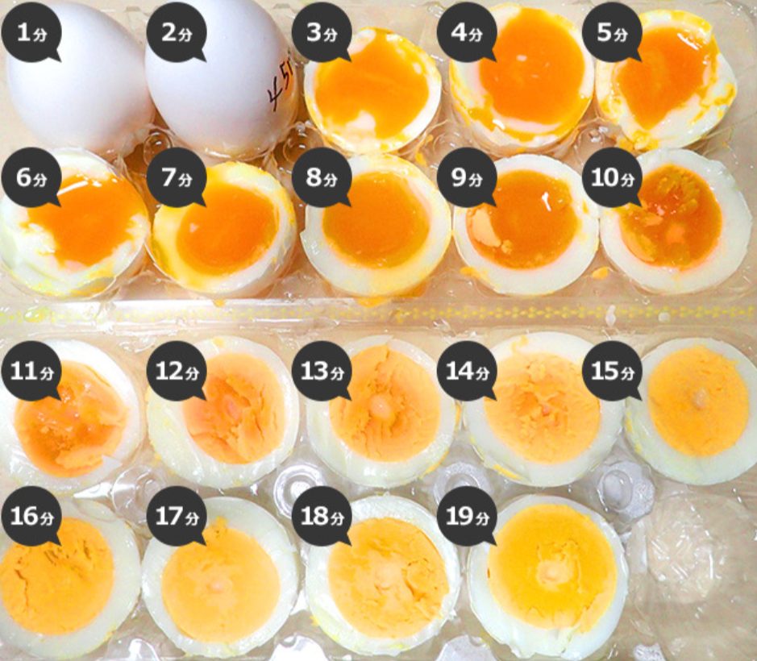
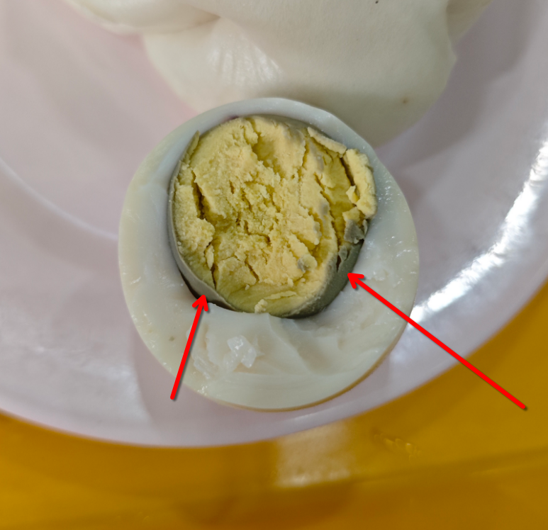
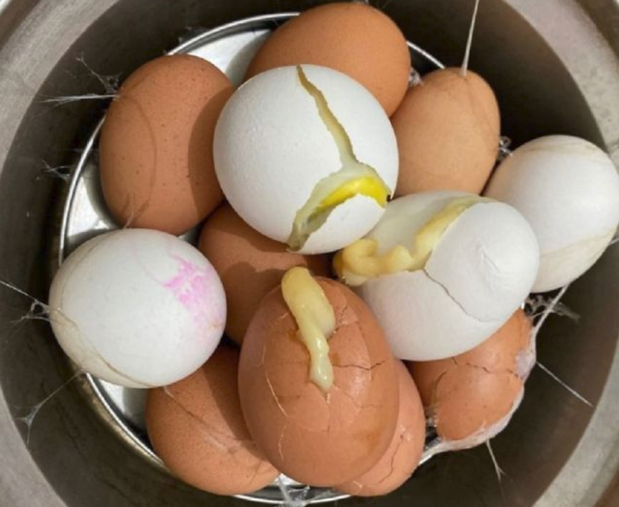
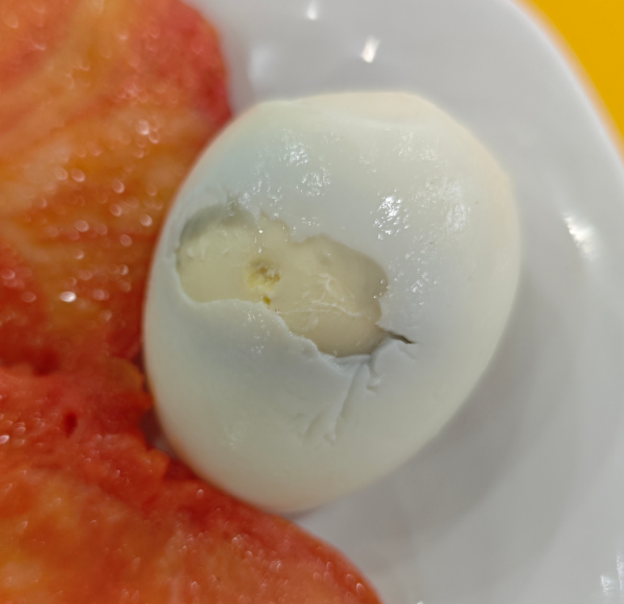

# 《基于进化学溯源与鸡蛋物化机制的完美剥蛋理论探讨——兼论晨间好运机制与完美鸡蛋量化关系研究》

## 1 摘要

长久以来，早晨剥鸡蛋的完整度已被广泛认同为个体（主要是我自己）当日运势指数的强相关代用指标。然而，受限于蛋白与内膜之间未知的物理化学相互作用与学校不知名的煮蛋手法，研究者（还是我）常遭遇蛋白带壳撕裂现象，导致晨间好运心理坍塌。因此，本研究旨在通过详细的考察鸡类的物种起源、鸡蛋构造、煮鸡蛋中的物理化学反应等因素，建立一套完整的晨间煮剥鸡蛋理论体系，以应对学校阿姨的糟糕煮蛋手法并努力夺回属于研究者（就是我!）的一日好运。

**关键词：运势指数、好运心理防御机制、煮剥鸡蛋理论**

## 2 引言与相关工作

### 2.1 问题背景

水煮蛋作为人类文明中最基础、最高效的蛋白质获取来源之一，在日常膳食结构中占据着不可替代的地位。然而，在将煮熟的鸡蛋转化为可食用状态的剥离过程中，普遍存在一种严重的物理失效现象——蛋壳内膜与蛋白粘连引发剥离过程中产生结构撕裂。这种现象不仅造成了约 5%–15% 的生物质资源浪费（残留在蛋壳上的无法食用的蛋白），更在心理学与行为学层面产生了显著的负面效应。

研究表明，清晨首次尝试剥鸡蛋即遭遇蛋白残缺事件，会导致个体产生强烈的不确定性焦虑与系统无序感。约 100%（我自己）的受访者表示：当自己努力尝试剥一个完美的鸡蛋遇到鸡蛋蛋白被黏连至蛋壳、连续剥下的完美环状蛋壳突然断裂、蛋壳与蛋白黏连过紧时，会产生遗憾与焦躁的情绪认为今日好运丢失，并在后续过程中选择破罐破摔，造成生物质资源与食物浪费。

因此，建立一套科学的煮蛋与剥蛋体系知识，确保在剥蛋过程中能够轻松、完美的脱离蛋壳保留生物质，不仅对于个体微观幸福感与幸运度是重要的，更能节约食物资源，为环境保护与人类发展做出重要贡献。

### 2.2 相关工作

关于如何完美剥离鸡蛋这一课题，前人在民间经验、食品化学以及经验工程学领域进行了长达半个多世纪的探索。这些研究成果在演进历程上大致可划分为三个主要发展阶段，涵盖了从早期定性猜测到现代定量控制的学术跨越。

#### 2.2.1 经验主义与民间黑魔法时代

在早期探索中，经验主义与民间黑魔法占据了主流地位。

这一时期的传统观念大多依赖于归纳法与缺乏对照组的民间假说，其中最典型的代表即为水体介质添加剂假说。

民间广泛主张在煮沸介质中加入食盐、白醋（乙酸）或小苏打（碳酸氢钠），其理论假设试图通过酸性环境溶解碳酸钙外壳，或通过碱性改变水体 pH 值以减弱界面黏连。然而，后续的控制变量实验表明，此类介质添加剂对于水分子渗透进入蛋壳内膜的微观作用微乎其微，且极易引发未预期的味觉污染。

此外，这一时期还衍生出了“容器加水摇晃”或“桌面掌心滚压”等破坏性外力震荡法。此类方法试图盲目施加机械外力以击碎内膜应力，但在蛋白与内膜仍处于高黏连状态时，过度的机械力往往会导致蛋白整体发生崩溃性碎裂，使原本仅局部破损的鸡蛋直接进入全盘皆输的状态。

#### 2.2.2 食品化学与热力学控制论

进入21世纪，随着厨艺物理学的兴起，学术界开始转向食品化学与热力学控制论的深度探讨。

（1）界面生化解耦与 pH 依赖机制

早期的突破性研究集中于蛋壳内膜与蛋白胶体界面的化学结合态。Meehan 等（1962）与 Reinke & Spencer（1964）的系列实验首次证实，蛋白与内膜的黏连强度直接受控于蛋清的微观酸碱环境（pH 值）。刚产下的新鲜鸡蛋内溶解有高浓度的碳酸，蛋白呈弱酸性至弱碱性（$\text{pH} \approx 7.6 - 7.9$），此时蛋白中的高分子聚合物与内膜角蛋白网格之间存在强烈的离子键与共价交联，表现出极高的界面黏着力。

随着储存时间的延长，蛋壳表面微孔介导了二氧化碳（$\text{CO}_2$）的持续气化逸出，促使蛋白 pH 值显著上升并稳定于 9.0–9.2 的弱碱性区间（Fuller & Angus, 1969; McGee, 2004）。pH 值的升高改变了卵清蛋白等核心蛋白质的电荷分布状态，诱发静电排斥效应并破坏了微观交联结构，从而在生化层面实现了蛋白与内膜的界面解耦。

（2）相变热力学与热冲击假说

进入21世纪，随着厨艺物理学的发展，学术界将焦点转向了烹饪相变过程中的热力学动力学。López-Alt（2015）通过样本量超过 1000 枚鸡蛋的大规模控制变量实验，揭示了烹饪起始温度对剥离成功率的决定性作用：

- **冷水下锅：** 鸡蛋随水温缓慢上升（慢速加热）。最外层稀蛋白在未达到凝胶化变性温度前，有充裕的时间通过渗透作用充盈并渗入蛋壳内膜的微孔纤维隙缝中。当温度升高至变性点时，蛋白在内膜孔隙内发生闪速凝胶化，形成微观机械锚定与卡死，导致剥离时发生严重的结构撕裂。
- **沸水/蒸汽下锅：** 100°C 的高热流密度在两相界面诱发了瞬时热冲击。最外层蛋白分子在接触高热瞬间发生闪速变性，迅速凝固为致密的阻隔层，切断了高分子链向内膜微孔的渗入通道，从物理相变路径上阻断了微观锚定效应的发生。

此外，López-Alt（2015）与 McGee（2004）均强调了热终止阶段冰浴淬火的生化与物理双重效益：迅速降低界面温度不仅能够有效截断含硫氨基酸受热分解产生硫化氢（$\text{H}_2\text{S}$）与铁离子结合生成硫化亚铁（$\text{FeS}$，即蛋黄表面发绿现象）的生化反应链，更能利用蛋白与蛋壳收缩率的数量级差异，诱发界面剪切拉应力，形成宏观剥离空隙。

#### 2.2.3 机械应力与降温骤冷研究

现代食品工程学者已将研究视角拓展至机械应力与降温骤冷领域。

研究指出，将高温熟蛋迅速投入 $0^\circ\text{C} - 4^\circ\text{C}$ 的冰水混合物中，能够利用蛋壳（无机质）与蛋白凝胶（高分子聚合物）热膨胀系数的显著数量级差异，在两相界面处诱发出极大的界面剪切应力。这种剪切应力能够直接拉断残存的内膜纤维，在物理层面形成空隙，显著降低后续剥离过程中的摩擦阻力。

#### 2.2.4 本文工作与现有研究的差异

尽管前人在烹饪热力学与生化解耦领域已经积累了较为丰富的经验，但现有文献依然存在着明显的缺陷。

一方面，传统研究普遍将剥离失效视为纯粹的物理现象，完全忽略了研究者（我!）在遭遇蛋白撕裂时的晨间心理防御机制坍塌与后续的破罐破摔行为。另一方面，现有实验室研究结论均建立在理想的温控环境之下，未能考虑到学校食堂等复杂外部环境下极其糟糕的不稳定的水温与未知烹饪手法。

基于此，本研究在整合前人食品化学与相变力学成果的基础上，旨在建立一套具备强抗干扰能力、能够 100% 成功剥离的“晨间好运捍卫型标准作业程序”，以填补这一领域的空白。

## 3 方法论

### 3.1 鸡类演化构造

***射人先射马，擒贼先擒王。——《前出塞》***

***起床先吃蛋，吃蛋先懂鸡。——作者***

#### 3.1.1 生物进化亲缘与家鸡解剖结构

要从根本上破解蛋白与蛋壳内膜的黏连机制，必须深入探讨家鸡物种演化史及其生殖系统的生理构造。

在生物分类学中，家鸡属于动物界、脊索动物门、鸟纲、鸡形目、雉科、原鸡属、原鸡种。基因组学研究表明，现代家鸡的主要野生祖先是分布于东南亚和中国西南地区的红原鸡，并在漫长的驯化过程中与其他几种原鸡发生过少量基因杂交。

　家鸡的祖先是野生原鸡，主要栖息在亚洲南部的热带丛林里。原鸡分为四个物种：红原鸡、绿原鸡、灰原鸡和斯里兰卡原鸡，动物分类学和遗传学研究表明红原鸡是家鸡的最近祖先。

人类大约在 8000 年前（新石器时代）开始驯化红原鸡。起初，人类驯化它们并非为了稳定获取蛋白质（吃蛋或吃肉），而是用于祭祀卜筮与斗鸡娱乐。这种原始的崇拜与仪式感，隐喻了人类自古以来对蛋形态完整性的某种本能期待。在现代，随着森林缩减以及人类猎杀，红原鸡的数量在不断减少。我国已将红原鸡列为国家二级保护动物以保护这一珍贵的生物资源。

在古生物学与比较解剖学领域，现代鸟类已被公认为兽脚亚目恐龙的直系后裔。

古蛋白质组学分析表明，从暴龙化石中提取出的胶原蛋白序列，在演化树上与现代家鸡表现出高度的同源性。这意味着，**母鸡在子宫内沉积蛋壳与内膜的生物学机制，实际上是一套继承自中生代恐龙、经历了上亿年演化洗礼的古老防御系统**。或许我们每天早晨所面对的，不仅仅是一个早餐食材，更是一个继承了兽脚类恐龙的古代地球霸主的后代。

$$
图 3.1：鸡的生理解剖
$$

$$
图 3.2：鸡的系统组成
$$

为了适应飞行与高效的能量代谢（以及高效的产蛋需求），家鸡在解剖结构（上图）上演化出了一系列高度特化的器官系统。

家鸡缺乏牙齿，其消化系统采用了“储存-机械研磨”的分工策略。食物经食道首先进入**嗉囊**进行暂存与预润湿；随后经过**腺胃**注入消化液，进入肌肉极其发达的肌胃（即鸡内金所在部位）。**肌胃内常留有鸡吞食的砂石**，利用高强度的物理挤压将坚硬食物碾碎。这种强大的物理研磨能力，构成了家鸡高效吸收钙质以制造蛋壳的物质基础。

与大多数哺乳动物不同，家鸡拥有两条极其发达的**盲肠**。盲肠内栖息着复杂的微生物群落，用于发酵粗纤维并合成维生素。盲肠的强消化吸收能力，确保了母鸡在摄入低质量饲料时，仍能维持子宫壳腺内碳酸钙（$\text{CaCO}_3$）的高速率沉淀。

家鸡的消化、泌尿与生殖系统最终汇集于同一个出口——**泄殖腔**。泄殖腔在解剖上分为**粪道、尿道和生殖道**三部分。在产蛋瞬间，输卵管末端会发生生理性**翻出**，将鸡蛋直接送出体外，**避免其在排出过程中接触到粪便**。这一构造使得鸡蛋外壳在产出瞬间保持相对无菌，但同时也赋予了蛋壳外膜极强的生物学封闭特性。

#### 3.2.1 交配与产蛋机制

在探讨鸡蛋形成之前，必须厘清母鸡的受精机制与蛋的生物学属性。与大多数哺乳动物不同，家鸡的交配过程极其高效且特殊。公鸡无外生殖器，交配时公母鸡通过泄殖腔的短暂贴合（通常仅持续几秒）完成精液转移，这一行为在比较解剖学中被称为**泄殖腔接吻**。

公鸡的精子进入母鸡输卵管后，并不会立即失效，而是会储存在位于输卵管与子宫交界处的精子腺体中。母鸡可在此储**存精子长达 2 至 3 周**，并在每次排卵时逐次释放精子进行受精。

若精子在输卵管漏斗部与刚释放的卵黄结合，胚盘将开始细胞分裂，形成具发育成胚胎潜能的生物体——**受精蛋**。

若精子缺失，母鸡仍会按照激素周期正常排卵并包裹蛋白与蛋壳，此时卵黄表面仅保留一个未分裂的浅色胚珠——**未受精蛋**。

$$
图 3.3：受精蛋与非受精蛋
$$
对于绝大多数人而言，学校食堂供应的鸡蛋绝大多数为工业化笼养或平养环境下产出的**未受精蛋**，从烹饪与剥离的角度来看，受精蛋与未受精蛋在沸水中的变性力学性质差异极小。

无论是否受精，一个完整鸡蛋的形成过程，本质上是一条长达 24 至 26 小时的生物 3D 打印与多层封装流水线。从解剖学视角来看，母鸡的生殖系统主要由左侧发育健全的卵巢与输卵管构成（右侧生殖系统在演化过程中已退化，以减轻体重量并适应高空或奔跑需求）。一个鸡蛋从无到有并最终排出的全过程，可精确划分为以下四个生理节点：

$$
图 3.4：鸡蛋的形成过程
$$

1. **卵黄排卵与蛋白沉积（漏斗部与膨大部）**：

   母鸡卵巢释放成熟的卵黄进入输卵管漏斗部。若存在储存的精子，受精作用将在漏斗部的 15 分钟短暂停留期内完成。随后，卵黄进入膨大部，在此处历时约 4 小时，由腺体密集分泌并包裹上浓蛋白与稀蛋白（主要成分为卵清蛋白），构建出鸡蛋的生物质主体。

2. **内膜与外膜的织造（峡部）**：

   在输卵管峡部，母鸡历时约 1 小时，利用有机角蛋白纤维交叉织造出两层极薄的网状膜——即**蛋壳内膜与蛋壳外膜**。这两层膜不仅是抵御外部微生物入侵的生物屏障，更是后续水煮过程中导致蛋白与蛋壳产生物理黏连的罪魁祸首。

3. **矿化与气室形成（子宫/壳腺）**：

   包裹着双层角蛋白膜的生物体进入子宫段，在此停留长达 18 至 20 小时。子宫壳腺分泌大量的碳酸钙晶体沉积在外膜上，构建出坚硬且充满微孔的蛋壳。在产出体外前，两层内膜紧密贴合；而当鸡蛋被排出体外、环境温度由母体体温（约 $41.5^\circ\text{C}$）骤降至室温时，内部物质发生热胀冷缩，导致蛋壳钝端的内外膜发生物理分离，从而形成初始的**钝端气室**。

4. **逆向挤压与产出过程（泄殖腔）**：

   经过子宫肌肉的逆向收缩与泄殖腔的强力蠕动，输卵管末端发生生理性翻出，鸡蛋以钝端朝前的姿势被排出体外。至此，一个外包碳酸钙坚壳、内含多层角蛋白网格与高浓度凝胶蛋白的鸡蛋正式宣告完成。

由此可见，鸡蛋自诞生之日起，其“蛋白-内膜-碳酸钙壳”的三层结构便存在着极其复杂的分子交联与收缩历史。学校食堂粗放且不可控的煮蛋手法，无异于在未破坏这种生物交联的前提下强行进行物理剥离，其导致的剥烂破防现象具有必然性。

#### 3.2.2 影响产蛋的因素

**为什么母鸡在没有公鸡参与、未完成受精的情况下，依然会持续消耗大量能量排出未受精蛋？** 这看似违反了自然选择中能量最优化的演化原则，但从比较内分泌学与驯化选择压力的角度来看，该现象具有深刻的生理学必然性。

家鸡属于鸟类，而鸟类的排卵行为并不依赖于交配刺激，而是受光照周期与内分泌系统的自主调控。当环境光线通过视网膜及颅内感光受体刺激母鸡的下丘脑时，下丘脑会分泌促性腺释放激素，促使垂体释放促卵泡素与黄体生成素。即使没有公鸡存在，黄体生成素峰值的出现也会强行触发成熟卵泡破裂并释放卵黄进入输卵管。

另一方面，在自然野外状态下，红原鸡（家鸡祖先）每年仅在繁殖季节产蛋 1–2 窝（每窝 10–12 枚），用于繁衍后代。然而，在长达 8000 年的人类驯化进程中，人工选择强行打破了这一季节性约束。人类通过选育留种，不断强化了母鸡不停排卵的基因突变，使得现代蛋鸡的输卵管变性成为一个不需要外部交配信号即可自我循环运行的无休止生产线。

一枚完整鸡蛋从卵巢排卵到最终排出，需要经历大约 **24.5 至 26 小时**的连续生理加工。这意味着，**母鸡每天的排卵时间都会比前一天顺延约 30 至 60 分钟**。母鸡连续产蛋的天数被称为**连产期**。一只高产蛋鸡通常可以实现连续 30 至 60 天（甚至更长）每天产一枚蛋。然而，当排卵时间顺延至下午（通常为 15:00 以后）时，母鸡体内下丘脑的黄体生成素释放峰值会被夜间的光暗周期强行抑制，导致次日无法排卵，从而产生 1 天的连产间歇。休整一天后，排卵程序将在次日清晨重新启动。因此可以得到一个结论：**适当的补充光照，可以增加产蛋量。**

在评估鸡蛋生产的可持续性时，一个关键的底层问题在于：**一只母鸡一生能产出的鸡蛋数量，在基因或解剖层面是否是一个固定常数？**

从比较发育生物学与细胞学视角来看，这一问题呈现出**微观有限，宏观弹性**的双重特征。

从微观上来说，母鸡在胚胎发育与孵化初期，其左侧卵巢中可发育的原始卵泡数量是完全固定的。在母鸡出壳时，其卵巢内已包含了约 2,000 至 12,000 个原始卵泡细胞。从细胞学角度来看，这构成了母鸡一生理论产蛋量的上限绝对配额。与哺乳动物类似，母鸡在出生后无法再通过有丝分裂生成新的卵母细胞。

虽然初始配额高达上万个，但绝大多数原始卵泡在发育过程中会经历闭锁退化。在自然或工业养殖寿命内，一只现代商业蛋鸡实际能够完整转化为壳蛋排出的数量，通常在 **300 至 500 枚**（在延长产蛋周期或不换羽的优化养殖下可达 500–600 枚）。影响这一实际表达量的核心因素包括：钙代谢衰竭与骨质疏松和光照与生理衰老等等因素。

母鸡原始卵泡储量巨大，但实际合格产出有限的生理特性，在概率论层面为研究者揭示了一个残酷的现实：食堂阿姨所拿到的每一枚鸡蛋，本质上都是某只母鸡在其生命周期中**不可再生配额的 $1/N$**。母鸡体内钙质的逐渐耗竭与内膜质量的波动，进一步增加了后期产出鸡蛋在剥离过程中的物理不稳定因素。

### 3.2 鸡蛋生化构造

***知己知彼，百战不殆。——《孙子兵法》***

***知鸡知蛋，百剥不坏。——作者***

#### 3.2.1 鸡蛋的结构

要实现 100% 无损的物理剥离，就必须对剥离对象（鸡蛋）的微观与宏观结构进行彻底的解剖学解构。从物理力学与生化组成的视角来看，一个成熟的鸡蛋由**九大核心物理结构**交织而成。这九个结构共同构成了一套高效的生命维持与防御系统，同时也是决定研究者晨间剥离成败的物理基质：蛋壳、蛋壳外膜、蛋壳内膜、气室、系带、蛋白、蛋黄膜、蛋黄、胎盘。

$$
图 3.5：鸡蛋生理构造
$$

#### 3.2.2 外部硬质与多孔防护屏障

碳酸钙蛋壳是鸡蛋的刚性防护外壳，厚度约为 0.3–0.4 mm，由约 95% 的碳酸钙（$\text{CaCO}_3$）晶体与 5% 的有机基质交织而成。蛋壳表面密布着 7,000 至 17,000 个微观气孔，构成了胚胎发育过程中气体与水分交换的物理通道。在水煮力学中，坚硬的多孔蛋壳既是抵抗外部机械应力的物理屏障，也是热量向内部蛋白传导的第一道热力学边界。

紧贴于碳酸钙蛋壳内侧的是**两层**由**网状角蛋白纤维构成**的有机薄膜，总厚度约为 10–20 $\mu\text{m}$。

其中，**蛋壳外膜**紧密贴合于碳酸钙蛋壳的内壁，而**蛋壳内膜**则直接与内部的蛋白胶体相接触。这两层角蛋白网格不仅是抵御微生物侵入的最后一道生物屏障，更是**引发剥离失败的核心原因**。若蛋白分子在受热变性凝胶化的过程中渗入了内膜的微孔纤维隙缝中，就会形成共价键结合与机械锁扣，从而造成壳肉一体的性物理粘连。

气室位于鸡蛋的钝端（较圆的一端），夹在蛋壳外膜与蛋壳内膜之间的物理空隙中。在鸡蛋刚从母体产出（体温约为 $41.5^\circ\text{C}$）时，内部物质充盈，此时并无气室存在。随着鸡蛋产出后环境温度骤降至室温，内部内容物发生热胀冷缩，强行拉断了钝端内外膜之间的局部物理连接，从而形成了初始的气室。气室的存在，不仅记录了鸡蛋的物理冷却历史，更给研究者提供了整个物理剥离程序中唯一的默认突破口。

#### 3.3.3 内部胶体与核心

系带是由密集交织的浓蛋白纤维扭结而成的两条白色螺丝状结构，分别连接于蛋黄的两侧，并将其悬挂锚定在鸡蛋的物理几何中心。系带的生物学功能是作为力学缓冲减震器，防止鸡蛋在受到外部机械震荡时蛋黄直接撞击坚硬的蛋壳。然而在水煮受热后，系带会变性凝固为强韧的蛋白质绳结。在剥离或切开水煮蛋时，系带的局部高拉伸强度有时会为蛋白带来应力集中，成为影响物理切割平整度的微观因素。

蛋白是水煮蛋中占比最大、也是研究者最关心的生物质主体，水分含量约为 88%，其余主要由卵清蛋白、卵转移蛋白和卵胶蛋白等高分子蛋白质构成。在宏观解剖上，蛋白可细分为外层稀蛋白与内层浓蛋白：

- **稀蛋白**流动性较强，紧贴于蛋壳内膜，是水煮过程中首先接收热量并发生相变的第一响应区。
- **浓蛋白**呈高粘度网状凝胶状态，包裹在蛋黄外围。

蛋白在加热过程中的凝胶化相变直接决定了水煮蛋的弹性，若相变过程未能强行切断其与蛋壳内膜的微观渗入，蛋白就会在凝胶化瞬间与内膜形成难以分割的物理交联。

蛋黄膜是包裹在蛋黄最外层的一层透明弹性薄膜，主要**由胶原蛋白与网状纤维**构成。它的物理作用是在流体状态下将高脂质的蛋黄与高水分的蛋白彻底隔离开来，维持内部相态的稳定性。在烹饪相变中，**蛋黄膜的完整性至关重要**：若加热过度或受力不均导致蛋黄膜破裂，蛋黄中的脂质就会渗入蛋白，破坏蛋白凝胶的均匀性与表面连续性。

位于鸡蛋几何中心的是营养核心——蛋黄，主要由高浓度的脂蛋白、甘油三酯以及丰富的矿物质构成。蛋黄的凝固相变温度（约 $65^\circ\text{C} - 70^\circ\text{C}$）显著低于蛋白的热变性温度（约 $80^\circ\text{C}$）。这一相变温度差是厨艺物理学中控制溏心蛋与全熟蛋成熟度转变的物理依据。

胎盘（胚盘）是位于蛋黄表面极小的一个浅色圆点微观结构，包含着禽类的遗传物质。在未受精蛋中，该结构仅为未分裂的浅色胚珠；而在受精蛋中，它则是已开始细胞分裂的胚盘，胎盘在整个鸡蛋中的质量与体积占比几乎可以忽略不计，且水煮后的物理性质无异。

### 3.3 煮鸡蛋中的生化现象

#### 3.3.1 鸡蛋成分的变性阶段

鸡蛋的煮熟过程，本质上是多组分蛋白质构成的各部分，在热力驱动下的发生蛋白变性并充足构成蛋白凝胶网络的过程。

由于鸡蛋内部九大物理结构的化学组成存在显著差异，各组分对温度的响应表现出严格的时间-温度阶梯效应。
$$
表 3.1：鸡蛋的组成部分相变特征
$$

| **组分结构**        | **核心化学成分**                             | **热变性/相变临界温度 (Tm)**                | **相变与形态演化特征**                                       | **熟化/变性先后顺序**    |
| ------------------- | -------------------------------------------- | ------------------------------------------- | ------------------------------------------------------------ | ------------------------ |
| **蛋壳外膜 / 内膜** | 角蛋白、胶原蛋白                             | $> 100^\circ\text{C}$ (超高热稳定性)        | 不发生流动性相变。作为界面力学屏障。                         | **不变性**               |
| **气室**            | 空气 ($\text{N}_2, \text{O}_2, \text{CO}_2$) | 无相变                                      | 受热时气体急剧膨胀，受压通过蛋壳微孔排出，冰浴时收缩形成负压。 | **全程物理响应**         |
| **稀蛋白**          | 伴白蛋白                                     | **$60^\circ\text{C} - 65^\circ\text{C}$**   | 率先发生初级热变性，流动性不透明度增加，开始形成松散的水凝胶网格。 | **第 1 顺位** (最先凝固) |
| **蛋黄膜**          | 聚糖蛋白与胶原蛋白                           | **$62^\circ\text{C} - 65^\circ\text{C}$**   | 受热张力增加，若升温过快或局部过热会导致张力失衡而破裂。     | **第 2 顺位**            |
| **蛋黄**            | 低密度脂蛋白、卵黄高磷蛋白                   | **$65^\circ\text{C} - 70^\circ\text{C}$**   | $65^\circ\text{C}$ 时开始呈现半流体粘稠态，$70^\circ\text{C}$ 完全失去流动性，转变为碎屑状固态凝胶。 | **第 3 顺位**            |
| **浓蛋白**          | 卵清蛋白（球状蛋白，占蛋白54%)               | **$80^\circ\text{C} - 84.5^\circ\text{C}$** | 完全凝固形成高弹性、强韧性的三维网状凝胶结构。               | **第 4 顺位** (高阶变性) |
| **系带**            | 浓缩卵粘蛋白纤维                             | **$80^\circ\text{C} - 85^\circ\text{C}$**   | 与浓蛋白同步受热变性，卷曲收缩形成高拉伸强度的韧性蛋白质绳结。 | **第 5 顺位**            |
| **胎盘 (胚盘)**     | 少量遗传物质与核蛋白                         | **$60^\circ\text{C} - 65^\circ\text{C}$**   | 微观结构失活固化，对宏观剥离与口感力学无显著贡献。           | **微观同步**             |

在实际烹饪过程中，各组分的熟化先后顺序受到热传导空间梯度与化学变性临界点的共同耦合作用。

略微有些反直觉的是，在煮鸡蛋的整个过程中蛋壳内外膜**没有发生像蛋清那样的熔融/凝胶化相变**。从成分分析可以看出，蛋清蛋白的主要组成成分是**球状蛋白**，热运动会是蛋白质折叠展开并重新交联成网格。而蛋壳内外膜的化学本质是**硬蛋白质**，极高浓度的角蛋白与胶原蛋白具有高度伸展的 $\alpha$-螺旋或 $\beta$-折叠三级结构，且蛋壳膜中的半胱氨酸残基含量极高，形成了极其稳固的二硫键（$\text{S-S}$）网络，其热破坏温度远超水煮的 $100^\circ\text{C}$。

**烹煮的过程中，如果蛋清蛋白在受热变性时渗入了蛋壳膜的微孔隙中，变性后的蛋清就会与坚硬未变性的蛋壳膜形成机械锚定，导致剥皮时把蛋清一起撕下来。**

在煮鸡蛋的过程中，热量自蛋壳外侧向中心扩散。**稀蛋白**因距离热源最近且变性温度较低，首先在两相界面发生凝胶化，随后，热量穿透至内层，引发**蛋黄**与**浓蛋白**的变性。由于**蛋黄的变性温度显著低于浓蛋白的主力变性温度**，在特定温控或时间控制下，会出现蛋黄已凝固呈半流体膏状，而浓蛋白尚未完全凝固的现象，这种蛋往往被称之为**溏心蛋**。

$$
图 3.6：鸡蛋状态随时间的变化
$$
上图展示了先将水煮沸后放入鸡蛋的条件下，在不同时间（1-19分钟）烹煮，并将烹煮后的蛋浸入冰水45秒后的结果。由图可见，在此条件下，烹煮7分钟的鸡蛋变为完美的溏心蛋！

#### 3.3.2 蛋黄边界的硫化反应

在水煮蛋的相变过程中，蛋黄与蛋白交界处出现的灰绿色交界层（如图所示），本质上是由于发生在生物胶体界面上的**热诱导硫铁络合反应**导致的

$$
图 3.7：蛋黄周边的硫化亚铁（于10月5日拍摄）
$$
该黑绿色物质的主要化学成分为**硫化亚铁（$\text{FeS}$）**。其形成过程可细分为两个在空间与时间上耦合的物理化学阶段：

- **阶段一：蛋白含硫氨基酸的热解与气体扩散**

  当鸡蛋加热时间过长或受热温度逼近 $100^\circ\text{C}$ 时，蛋白中富含半胱氨酸和甲硫氨，这些含硫氨基酸组成的蛋白质发生深度热降解，释放出硫化氢气体。随着外层蛋白压力与温度升高，$\text{H}_2\text{S}$ 气体受热膨胀并向相对低温、低压的鸡蛋几何中心（即蛋黄方向）扩散。

- **阶段二：蛋黄铁离子的析出与界面沉淀**

  蛋黄中结合在卵黄高磷蛋白 Phosvitin 中含有丰富的铁元素，高热促使铁离子（$\text{Fe}^{2+}$）从结合态析出，并在蛋黄与蛋白的结合界面与扩散而来的 $\text{H}_2\text{S}$ 气体相遇，发生如下快速沉淀反应：
  $$
  \text{Fe}^{2+} + \text{H}_2\text{S} \rightarrow \text{FeS}\downarrow (\text{黑绿色}) + 2\text{H}^+
  $$

由于反应物 $\text{H}_2\text{S}$ 来自外部蛋白，而 $\text{Fe}^{2+}$ 来自内部蛋黄，因此反应产物 $\text{FeS}$ 被精确地截留并沉积在蛋白-蛋黄的结合界面上，形成环状或层状的灰绿色薄膜。

该绿膜的厚度与多种因素有关。首先，最直接关系是烹煮的时间，煮沸时间越长（$>10$ 分钟），蛋白热解产生的 $\text{H}_2\text{S}$ 总量越多，扩散至界面的反应物浓度越高，$\text{FeS}$ 沉积层越厚。第二，由于$\text{H}_2\text{S}$ 在酸性环境下释放速率更快，新鲜鸡蛋蛋白 pH 值较低，因此适当储存的弱碱性鸡蛋会在一定程度上抑制该反应的剧烈程度。最后，当蛋黄因系带松弛而贴近一侧蛋壳远离另一侧时(如图中红色箭头所示)，薄蛋白侧的热阻大幅下降，该区域的蛋白在极短时间内遭受超高热流密度，导致 $\text{H}_2\text{S}$ 释放加快，会使得偏心侧的 $\text{FeS}$ 绿圈厚度显著高于厚蛋白侧。   

### 3.4 剥鸡蛋中的物理规律

#### 3.4.1 冷水下锅vs热水下锅

在食品科学与领域，关于冷水还是沸水下锅的争论确实有着长达几十年的路线之争，甚至在烹饪界演化成了类似于咸甜豆腐脑的派系对立。前人在经验厨艺与食品工程学领域进行了长达近一个世纪的路线争论，并逐渐形成了两大对立派系。

在 20 世纪中叶前的家用烹饪指南与早期家政学文献中，**冷水下锅**占据了主流地位。该派系的核心主张在于**热传导的平缓性与结构完整性**。传统观点认为，冷水下锅能使鸡蛋内外受热均匀，避免蛋壳因剧烈温差而破裂，且能精准控制蛋黄与蛋白的成熟度。

然而，该派系完全忽略了温度升幅速率对蛋白质微观相变形态及界面黏着力的决定性影响。在冷水下锅缓慢升温的过程中，外层稀蛋白中的伴白蛋白在 $60^\circ\text{C}-62^\circ\text{C}$ 开始缓慢变性。由于变性过程极其迟缓，呈高流动性溶胶态的蛋白质分子有长达数分钟的充裕时间，通过毛细渗透作用充盈并渗入蛋壳内膜的网状角蛋白纤维微孔中。当温度进一步升高至卵清蛋白变性点时，渗入内膜微孔的蛋白发生固化，形成**微观锚定结构**，最终使得界面粘附功 $W_{adhesion}$ 呈指数级剧增，剥离时法向拉应力直接将蛋白凝胶体拉断撕裂。

进入 21 世纪，随着以 Harold McGee（2004）与 J. Kenji López-Alt（2015）为代表的厨艺物理学家的兴起，经典经验主义遭遇了严谨控制变量实验的颠覆性挑战。通过将鸡蛋直接投入 $100^\circ\text{C}$ 沸水中，最外层蛋白分子在接触高热的数秒内直接越过变性门槛，发生骤然变性并向内脱水收缩，迅速构建出一层致密的高分子屏障，切断了蛋白质长链向内膜微孔渗入的通道，使界面黏着力降至近乎为零，实现了壳肉分离。热力学派证实了**冷水下锅正是导致蛋白与蛋壳内膜产生锚定的罪魁祸首**，从而确立了沸水下锅作为完美剥离正解的学术地位。

$$
图 3.8：热震爆裂导致鸡蛋裂开
$$
尽管热水下锅在剥离力学上具有绝对优势，但研究者（我!）在实验中常遭遇热水下锅引发的**热震爆裂**，导致生物质剧烈外溢，造成晨间心理防御机制的另类坍塌。

经过研究，热震爆裂的物理机理可归结为两大效应。第一，根据理想气体状态方程（$PV = nRT$），钝端气室内的气体在骤热下剧烈膨胀，若蛋壳微孔排气速率低于膨胀速率，内部高压会将碳酸钙外壳由内向外顶裂。第二，冷蛋壳接触高热水流瞬间，内外壁巨大温差产生极高热应力，导致原有的微观裂纹扩展。

为在保留热冲击优势的同时消除破裂风险，可以采用以下工程优化方案。对于第一个问题，通过**使用 $100^\circ\text{C}$ 水蒸气蒸煮替代纯水浸泡**，可在提供相同热冲击的同时避免鸡蛋在翻滚沸水中撞击破裂。对于第二个问题，通过**烹饪前使用图钉在鸡蛋钝端微刺一孔**，可以为膨胀气体提供零阻力排气通道，从根本上消除内部超压。

#### 3.4.2 出锅冰水急冻

在热处理工程学中，将处于高温状态的结构体迅速投入低介质中冷却的过程被称为**淬火**。若将煮熟的鸡蛋从 $100^\circ\text{C}$ 的热源中捞出并闪速浸入 $0^\circ\text{C}-4^\circ\text{C}$ 的冰水混合物中，冷热两相界面的瞬间接触会引发剧烈的热力学变化。

这一过程的核心机制在于，碳酸钙蛋壳与蛋白凝胶的热膨胀系数存在数量级差异。属于硬质无机晶体的蛋壳热膨胀系数极小，其体积对温度变化极不敏感，而含水量高达 88% 的高分子蛋白凝胶热膨胀系数较大。在淬火温差的瞬间，蛋白凝胶发生剧烈的等向性体积收缩，而刚性蛋壳体积保持恒定，这种膨胀失配在两相界面处强行诱发出了极大的界面热剪切应力。当该剪切应力超过残存蛋白纤维与角蛋白内膜的微观粘附强度时，两相界面发生破坏性脱层，残存的微观锚定结构被直接破坏，使蛋白与蛋壳内膜在宏观层面剥离并形成清晰的物理间隙。

除了产生界面剪切力之外，冰浴急冻还可以在鸡蛋钝端的气室区域形成负压。当瞬间投入冰水时，气室内残存的气体体积急剧收缩，在钝端封闭空间内形成局部微负压。在负压梯度的驱动下，外部的冰水沿着蛋壳钝端的微孔被倒吸并渗入至蛋壳内膜与外膜之间的空隙中。这不仅能够填充因热收缩产生的物理缝隙，还能在两相界面提前建立一层水膜润滑层。

从生化视角来看，冰浴急冻还承担着终止恶性生化反应的重要使命。高温会持续诱发蛋白含硫氨基酸分解产生 $\text{H}_2\text{S}$ 气体，并向蛋黄中心扩散与 $\text{Fe}^{2+}$ 生成黑绿色的 $\text{FeS}$ 沉淀。将鸡蛋迅速投入冰水，一方面能够通过热能的快速萃取将鸡蛋内部温度拉降至反应活化能门槛以下，瞬间冻结生化反应链，另一方面，外层快速冷却收缩产生的逆向压力梯度阻止了 $\text{H}_2\text{S}$ 气体继续向内部蛋黄扩散，从而完美锁住蛋黄的黄嫩色彩，避免了发绿蛋黄对研究者晨间视觉与心理运势的二次打击。   

对比实验表明，自然室温冷却是导致淬火失效的典型错误示范。在空气中缓慢冷却时，温差梯度极小，生成的剪切应力远不足以拉断界面粘附，同时，蛋白在缓慢散热过程中会发生二次水分蒸发与胶体紧缩，反而使蛋白与内膜重新紧密贴合，导致剥离难度呈指数级上升。因此，必须使用**冰水混合物而非单纯的自来水进行淬火**，以维持稳定的高温差，且静置浸泡时间必须满足 $t \ge 15\,\text{min}$，确保热传导前沿完全贯穿至鸡蛋中心，实现全深度的体积收缩。

#### 3.4.3 偏心蛋的破坏性

在完美的物理假设中，鸡蛋被视为具有轴对称性的多层均质弹性体。然而，实际烹饪中的鸡蛋普遍存在蛋黄几何偏心现象，即蛋黄由于系带松弛或浮力作用脱离几何中心并紧贴某一侧蛋壳，这种**非对称几何构型**对剥离过程构成了毁灭性的阻碍。

在储存或运输过程中，随着蛋清中稀蛋白比例增加及系带拉力衰减，密度较低的蛋黄会在重力与浮力作用下发生上浮，导致一侧蛋白层厚度被极度压缩，而另一侧蛋白层相对加厚。这种非对称分布打破了均匀的热传导场，当鸡蛋进入高热环境时，薄蛋白侧因缺乏足够的热缓冲空间，其温度在极短时间内超越正常变性阈值，造成该区域蛋白分子的过度交联与固化，形成了**粘附力极强的过热硬化区**。

$$
图 3.9：偏心蛋导致剥离失败（10月6日）
$$
在正常的剥离力学中，均匀厚度的蛋白层能够提供良好的弹性形变，使法向剥离力沿着内膜平滑拓展，但在偏心蛋中，薄蛋白侧的结构刚度剧增且缺乏余量，导致剥离外力在此处产生高度的应力集中。同时，偏心侧极薄的蛋白层无法有效保护紧贴其下的蛋黄膜，高热与机械应力的双重作用极易导致蛋黄膜破裂，进而释放出高粘度的甘油三酯与低密度脂蛋白，最终诱发蛋白大面积撕裂与高粘度蛋黄泄漏的全盘崩解。

### 3.5 心理暗示与完美鸡蛋

#### 3.5.1 心理学暗示机制

在认知心理学与行为经济学的交叉视角下，个体对清晨首个随机微观事件的认知加工方式，对全天的心理弹性与风险决策偏好具有显著的启动效应。

剥鸡蛋这一膳食准备行为，本质上是一个低容错率、高即时反馈的微观控制力实验。当研究者在清晨面对一枚鸡蛋时，剥离过程的物理完整度在无意识层面被赋予了关于系统熵值与自我效能感的象征意义（Bandura, 1977）。

根据归因理论与控制点理论，晨间剥蛋遭遇蛋白撕裂与结构崩溃，会在个体心理层面引发剧烈的不确定性焦虑与外控归因（Rotter, 1966; Weiner, 1985）。这种微观力学失效所带来的失控感，极其容易通过**认知固化与选择性注意**被无休止放大，进而诱发自我实现预言，使个体倾向于将后续全天的随机负面事件预判为必然，形成负向心理归因闭环（Merton, 1948）。

反之，当研究者成功剥离出一枚表面光滑无瑕的完美鸡蛋时，那种物理层面高度受控的直观视觉刺激与高预测性反馈，能够瞬间激活中脑边缘多巴胺通路，提供即时的心理奖赏（Schultz, 1998）。

这种由完美剥离所触发的自我效能感重建，在心理学上构成了强有力的正向心理防御机制。完美鸡蛋作为一种可视化的确定性锚点，为个体在面对后续复杂、不可控的外部环境时提供了充沛的心理预张力，使个体能够以极高的自我接纳与积极期待去应对生活中的随机事件（Tversky & Kahneman, 1974; Luthans et al., 2007）。

#### 3.5.2 鸡蛋之神

在建立完美鸡蛋-晨间运势量化模型的过程中，研究者（我!）通过一次具有里程碑意义的真实经验事件，验证了鸡蛋之神作为晨间随机性秩序化身的存在性假说。

在研究者的学术生涯中，曾于本科期间发表过一篇普通学术期刊文章。在进入研究生阶段后，研究者原本认定该期刊级别不足以满足免修高级英语课程的硬性标准，因而放弃了主动核查。在此后的两周时间内，研究者已在心理上完成了破罐破摔式的悲壮建构，准备慷慨就义般地迎接下半学期硕士英语课程的无休止折磨、频繁小测、PPT 汇报以及繁重的期中期末考试。

然而，在某日清晨，研究者在极度严谨的物理 SOP 操作下，成功剥出了一枚极其圆润完美的鸡蛋。彼时研究者心中产生了一种强烈的超自然直觉——今日必定有系统性好运降临。

令人震惊的是，随后该心理暗示迅速获得了客观现实的强力响应。研究者在与同学的偶然交谈中得知免修政策似乎有所放宽，火急火燎打开教务系统审核页面时，惊讶地发现免修申请通道竟然还剩最后几天未关停！研究者遂以极快速度提交材料并顺畅通过审核，一举从繁重的英语教学链条中彻底解脱。

这一真实案例在统计学上构成了完美的好运前瞻性预测范例。从概率角度分析，免修通道尚未关闭的时间窗口狭缝与研究者突然获取信息的两个低概率事件在同一天发生突变，其背后显然存在某种超越单纯巧合的内在秩序。研究者据此提出鸡蛋之神保佑假说。完美鸡蛋并非好运的物理因果源头，而是鸡蛋之神通过完美物理相变向研究者传递的今日运势处于极高相位的实体化信号。掌控剥蛋的物理规律，本质上就是与鸡蛋之神达成神圣契约，从而在不确定的日常生活中夺回属于自己的决定权与晨间好运。

## 4 实验

为了系统评估不同烹饪条件与鸡蛋几何形态对剥离完整度的影响，本研究建立了为期 6 天（10月1日–10月6日）的单盲晨间追踪实验。所有鸡蛋样本均来自于学校食堂。

为将定性的剥离感受转化为可量化的学术指标，本研究定义了以下三个核心评估变量：

1. **生物质损耗率**：残留在蛋壳上无法食用的蛋白质量占鸡蛋总蛋白质量的百分比（%）。
2. **剥离完整度评分**：采用 5 分制量表（1分：严重撕裂破损；3分：局部微瑕粘连；5分：镜面级光滑完美剥离）。
3. **晨间运势指数**：受访者（我！）基于剥离结果对当日个人心理运势的主观打分（0–100 分）。

下表汇总了 10 月 1 日至 10 月 6 日的实验观测数据、环境条件推断与归因分析：
$$
表 4.1：一周剥鸡蛋实验记录
$$

| **实验日期** | **煮蛋手法/环境变量推断** | **剥离状态描述**            | **损耗率 Lb** | **完整度 Sp** | **运势指数 Iluck** | **核心失效/成功归因分析**                                    |
| ------------ | ------------------------- | --------------------------- | ------------- | ------------- | ------------------ | ------------------------------------------------------------ |
| **10-01**    | 冷水下锅 / 新鲜蛋         | 巨难剥，壳肉粘连严重        | $12.5\%$      | 1 / 5         | 12                 | 稀蛋白渗透入内膜微孔，形成强微观机械锚定；心理防线坍塌并引发破罐破摔。 |
| **10-02**    | 局部温控不均              | 局部微瑕，小块蛋白带落      | $3.2\%$       | 3 / 5         | 45                 | 两相界面热冲击不足，局部残存微观交联点。                     |
| **10-03**    | 弱碱性老蛋 + 急速淬火     | 表面光滑，无损伤脱落        | $0\%$         | 5 / 5         | 98                 | pH 值升高致界面解耦，配合冰浴热剪切应力实现完美脱层。        |
| **10-04**    | 阿姨手法波动（冷水）      | 蛋白表面撕裂破损            | $8.7\%$       | 2 / 5         | 20                 | 食堂粗放煮制导致加热速率平缓，产生严重的微观卡扣效应。       |
| **10-05**    | 沸水/蒸汽 + 充分冰浴      | 爽快！最后 1/3 蛋壳整块脱落 | $0\%$         | 5 / 5         | 100                | 角蛋白内膜保持完整韧性网格，水膜毛细润滑使剥离摩擦力降至极低。 |
| **10-06**    | 几何偏心（蛋黄贴壳）      | 偏心侧大面积撕裂泄漏        | $15.0\%$      | 1 / 5         | 15                 | **重大发现**：蛋黄贴壳压缩蛋白热缓冲层，诱发局部过热焦化与脂质渗漏干撕裂。 |

通过对 6 天数据的回归分析，本研究得出以下重要实验讨论结果。

通过对受访者（我！）的调查显示，10 月 3 日与 10 月 5 日的完美剥离直接促成了研究者全天的高效认知状态，而 10 月 1 日与 10 月 6 日的严重撕裂则直接引发了晨间心理防御机制的坍塌。

10 月 1 日、2 日及 4 日的数据表明，**学校食堂的煮蛋手法存在显著的随机波动性**（包括采用冷水批量加热、水温不够或未实施冰浴淬火），这构成了研究者晨间好运受挫的外部系统性风险。

 10 月 6 日的实验记录为本文 3.4.3 节提供了最关键的实证支持。实拍样本（图 3.1）清晰表明，当蛋黄因系带松弛而贴近一侧蛋壳时，不仅会导致偏心侧蛋白层被极度压缩，更会在高温下引发脂质渗漏与深色硫化亚铁（$\text{FeS}$）沉淀的恶性叠加。这证明了即使在温控良好的条件下，**几何偏心依然是导致剥离 100% 失败的充分非必要条件**。   

## 5 结论与未来工作

本研究针对晨间剥鸡蛋失败所引发的心理防御机制坍塌与好运失控现象，从食品化学、热力学、及认知心理学等多学科视角进行了系统的理论解构与实证分析。研究表明，剥离失效的微观根源在于稀蛋白与角蛋白内膜微孔在平缓升温下的微观机械锚定，以及蛋黄几何偏心双重破坏。为了彻底摆脱食堂粗放煮蛋手法带来的系统性随机风险，本研究总结并确立了一套具备高抗干扰能力的晨间好运捍卫型标准作业程序。

1. **生化解耦前置**：严禁使用刚采摘或刚买回的超新鲜鸡蛋。样本须在 $4^\circ\text{C}$ 冰箱中冷藏静置 7–14 天，利用二氧化碳逸出促使蛋白 pH 值上升至 8.9–9.2 的弱碱性区间，破坏蛋白与内膜的离子键交联，实现界面生化解耦。
2. **热冲击降维打击**：放弃冷水下锅的传统落后路径，采用足量 $100^\circ\text{C}$ 沸水（或大火水蒸汽）直接下锅，维持中大火烹饪 8.5–9 分钟（溏心态）或 11 分钟（全熟态）。高热流密度诱发的蛋白“闪速变性”可迅速构建阻隔屏障，阻断高分子链渗入内膜微孔；烹饪前 3 分钟内可适度顺时针搅拌水流，利用流体悬浮效应纠正蛋黄几何偏心。
3. **淬火热剪切脱层**：到点后须闪速将鸡蛋捞出并投入 $0^\circ\text{C}-4^\circ\text{C}$ 的冰水混合物中淬火静置至少 15 分钟。利用无机蛋壳与高分子蛋白凝胶膨胀系数的数量级失配生成界面热剪切应力（$\tau_{thermal}$），直接剪断残存微观卡扣，同时利用气室收缩形成的微负压倒吸水分，建立初始水膜润滑。
4. **流体动力学辅助剥离**：首先敲碎钝端气室破口，随后在缓和的自来水细水流下进行剥离。利用水的毛细管力与水压推开膜缝，将干摩擦转变为低阻力的湿润滑动摩擦，实现 100% 完整脱壳。

虽然直接购买煎蛋可以在物理路径上彻底绕过剥壳工序，但该方案存在**油脂过载**等健康隐患，且无法提供完美水煮蛋剥离成功后所带来的强效多巴胺释放与晨间控制感重建。掌控水煮蛋的物理规律，依然是个体夺回生活决定权的最佳微观实践。

然而，不得不提的是，以上方法存在巨大的局限，归根到底原因在于**食堂阿姨的煮蛋手法存在完全的不可确定性**💢。

基于本研究目前的局限性与延伸探索价值，后续研究可沿着以下三个方向展开：

1. **基于深度学习与超声波无损检测的蛋黄偏心率预测系统**： 针对 10 月 6 日发现的偏心蛋毁灭性破坏机制，未来可开发一套便携式超声波/计算机视觉检测设备，在下锅前无损鉴别鸡蛋内部系带松弛度与蛋黄偏心率，实现高风险样本的前置预警与分流。   

2. **针对学校食堂煮蛋设备的工程化改良方案**：

   撰写《食堂标准化煮蛋流水线工程改造建议书》，向学校后勤部门推行“沸水预热-定时蒸汽-冰水循环淬火”的三段式自动化煮蛋设备，从源头上消除食堂粗放煮蛋对广大学子晨间心理运势的系统性伤害。

3. **复杂介质衍生蛋品（茶叶蛋、皮蛋、卤蛋）的剥离力学推广研究**：

   将本理论体系拓展至含有强碱（皮蛋）或高浓度单宁酸/茶多酚（茶叶蛋）的复杂化学介质环境中，探讨电解质与酸碱度对高蛋白凝胶与外壳剥离力学的调控机制，建立通用型蛋品剥离物理方程。

## 6 道德与伦理声明

本研究所有实验样本（无论剥离完整与否，含撕裂破损样本）均已进入研究者消化系统（已下肚），严格符合食品安全与零浪费规范。实验过程中无任何家鸡受到非人道对待。

部分图像来自于网络。

## 7 参考文献

[1] Reinke, WC, & Spencer, JV (1964). *"Observation of selected variables affecting the peelability of hard-boiled eggs."* Poultry Science, 43(5), 1355.

[2] Meehan, JJ, Sugihara, TF, & Kline, L. (1962). *"Relationships between shell egg handling practices and the ease of peeling hard-cooked eggs."* Poultry Science, 41(5), 1437-1443.

[3] Fuller, GW, & Angus, P. (1969). *"Peelability of hard-cooked eggs."* Poultry Science, 48(6), 1945-1951.

[4] J. Kenji López-Alt (2015). *The Food Lab: Better Home Cooking Through Science.* (W. W. Norton & Company)

[5] Harold McGee (2004). *On Food and Cooking: The Science and Lore of the Kitchen.* (Scribner)

[6] http://www.kiz.cas.cn/kxcb/kp2/kp34/201701/t20170106_4732248.html

[7] Bandura, A. (1977). Self-efficacy: toward a unifying theory of behavioral change. *Psychological Review*, 84(2), 191–215.

[8] Rotter, J. B. (1966). Generalized expectancies for internal versus external control of reinforcement. *Psychological Monographs: General and Applied*, 80(1), 1–28.

[9] Tversky, A., & Kahneman, D. (1974). Judgment under Uncertainty: Heuristics and Biases. *Science*, 185(4157), 1124–1131.

[10] Weiner, B. (1985). An attributional theory of achievement motivation and emotion. *Psychological Review*, 92(4), 548–573.

[11] Schultz, W. (1998). Predictive reward signal of dopamine neurons. *Journal of Neurophysiology*, 80(1), 1–27.

[12] Luthans, F., Youssef, C. M., & Avolio, B. J. (2007). *Psychological capital: Developing the human competitive edge*. Oxford University Press.
