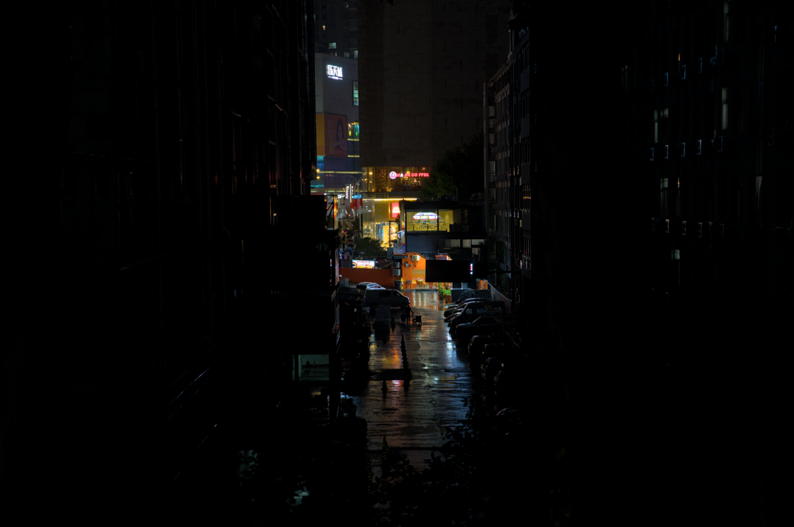
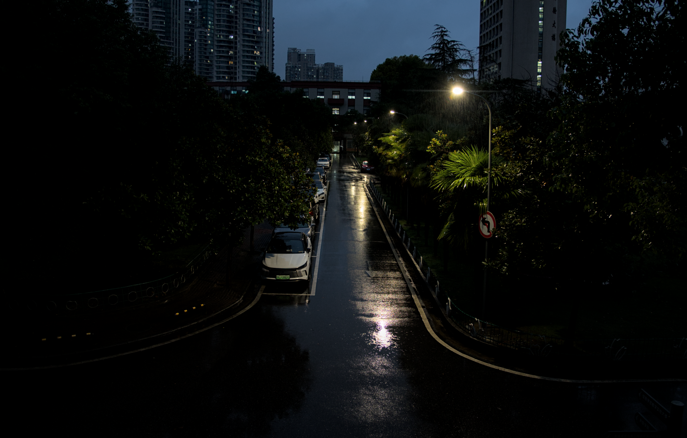
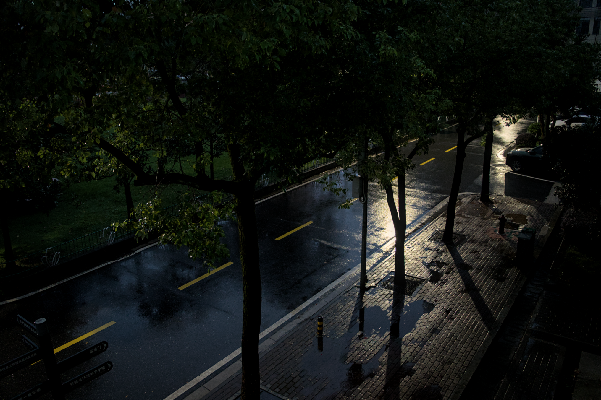

# 雨夜杂谈-2026年10月3日

从10月1号开始，气温就突然下降了很多，这几天都只有十几度，今天，下了一整天的雨。

不知怎么的，今天有点什么都不想做，就这样一直发呆到了晚上，于是突然不知怎么的，就决定拿着相机出去拍几张，雨夜的照片，顺便写了这样的一篇小杂谈，这篇杂谈其实没什么想说的，也并不是讨论什么宏大的技术哲学和人生态度，只是单纯想与你分享这一份，在繁忙的现代社会里难得的“静”。

第一张照片我很喜欢，两边是黑暗的街道，中间则是繁华城市的远景，给我一种“热闹的寂静”的感觉；后面两张则是从学院楼的窗户上拍摄的，只有路灯和空无一人的街道。

18度，小雨。我很喜欢这种日子，清凉的雨雾溅到身上，空气里都是泥土的气息，凉飕飕的微风吹过脸庞，让人的心都能够静下来。唯一的担忧就是我种的花花们已经一个多星期没有见到太阳了，而且这个天气土壤也一直都感觉很潮湿...虽然看着长得一切安好，但还是真的有点担心我的花花们会不会烂根呢...

这样的时间，不由得让我想起来以前玩过的一款游戏，叫做《交响乐之雨》。

那是一个，一年四季都在不断下着雨的城市...那样的城市是否就如同今天的这里一样呢？

说到这里，突然想听一听那一首《I'm always close to you》了，这几句歌词是我最喜欢的。

“行きつけない时はゴールが欲しくて，当目标遥不可及就想要快点看到终点”

“ただもどかしくもがいて走った，不断着急挣扎的跑着”

“ゴールが见えると今度は惜しくて，当看到了终点之时，又开始遗憾起来”

“もっともっといたい，还想一直待在这里”

“まだ続けていたいって思うのね，还想继续不停的跑下去”

---

眼前看着这些歌词伴着雨声，思绪不由得发散。

感觉自己在这些年里获得了很多东西，同时也失去了很多东西。获得了各种各样领域的知识、构建复杂系统的逻辑与能力、写下了以万字计的文章，得到了别人的尊重，找到了自己热爱的事物，没有辜负任何一个人甚至哪怕对自己的承诺，但是却在不知不觉之中，却丢失了什么东西，那究竟是什么呢？

人们常说，大脑会美化过去的回忆，或许真的是这样吧。那就像回忆里的一道光，看得见，但当努力伸出双手时，却怎么也抓不着。有时候我会觉得，自己变成了一个无聊的大人，对一切都开始变得慢慢不再情绪化，学会了对自己不能掌控的事物允许自己放手，也越来越认识到现实社会充满了无奈和不公；但有时候我又觉得自己还是个孩子，会因为种的花开了而开心一整天，会许愿早上剥一个完美的鸡蛋，成功的话今天会有好运气，看到操场上孩子们的笑容，会感觉唤醒了自己内心的某种东西，这种奇怪的感觉，究竟是什么呢？我无从得知。

---

***当目标遥不可及就想要快点看到终点***

想起来大一刚入学的时候，我还什么都不会，甚至连自己应该学什么都完全不知道，就好像一个刚刚学会在泳池有用的人，就被突然扔进了大海里自生自灭。我当时非常焦虑，感觉自己不再是特殊的那一个，身边的同学们也要比自己优秀得多，这种断层式的“泯然众人矣”和“不知道自己应该做什么”的感觉，让我时常焦虑到睡不着。

好在高中时自学的经历给我的底子，我花了整整大一上半个学期，才终于努力的弄清楚自己应该去学习什么。接下来又是笨拙的尝试，其实要论天赋，我并不是什么聪明人，甚至说我经常感觉自己很笨，很多事情学不明白，学得慢，我很羡慕那些聪明的同学们。

还记得我大一上学了C++一个月之后，周末两天的时间我就泡在图书馆里，尝试用easyx来写了一个俄罗斯方块。那是一个很简单的游戏，总共只有差不多一千来行的代码，不过用现在我的话来讲，当时写的完全就是屎山，各种莫名其妙的类，还有固定死帧率的游戏循环，完全没有逻辑和架构可言，性能也极其差劲。

不过这就是我的启蒙之旅，我的第一个作品。

---

***不断着急挣扎的跑着***

当我完成我的第一个作品之后，我又陷入了迷茫。

整个大一下学期，我没有再学习什么新的技术，而是把很多时间花在了学数据结构、数据库、高等代数这些课上。其实，这是因为我不知道自己该做什么了，各种技术五花八门让人眼花缭乱，我该继续从什么开始学起呢？

大二上学期开始，我稍微打起了一些精神，决定从web技术开始入手。我学习了nodejs，当时我还笨到花了很久才搞清楚nodejs和浏览器里的js的区别。

然后我又学习了vue，不过现在想想，其实好像从bilibili的课里，自己什么也没有学到。

然后我的做事习惯又来了，因为当时了解了electron，于是我就开始尝试用vue和js来写一个自己的播放器（网易云音乐没有linux版），我搜集了很多资料，甚至蠢到自己去破译网易云的webapi（甚至我真的破译了他的加密算法，花了我整整一个星期），但是最后我才发现github上早就有这样的项目了。

那个播放器我整整写了一个多月，包括真正学习使用vue3，真正学习webAudio，真正自己去写那些歌词定位算法和简单的后端。总共写了一万多行代码，虽然现在看来，也确实是一个巨大的，毫无架构和规范可言的屎山，但是当时写完之后给了我巨大的成就感。当看到自己一个多月的成果成功的跑了起来，那种自豪是发自内心的。

这件事也真正让我开始意识到，我不能在这样继续下去了，我缺少一些真正的基本功。

于是我再次放弃了继续写项目，而是开始研读书籍。我记不清楚从那时到现在，我已经读了多少书了。计算机组成、操作系统、计算机网络、编译原理、动手学深度学习、人工智能：一种现代方法、设计模式...等等等等。

就这样，我朝着自己的目标不断挣扎着。

---

***当看到了终点之时，又开始遗憾起来***

时光飞逝，到了大三，当我接触了Rust之后，我真的发生了一次蜕变。

记得一开始我写Rust的时候，几乎写几行就会报错一行，这种负反馈可真是折磨人的。我不知道尝试了多久，才把第一个简单的程序跑通，这语言，可真太难伺候了！

但当相处久了之后，你会爱上这门语言。他会交给你真正的代码应该怎么写，强制你提前思考架构应该如何划分。甚至我还接触了Bevy，为它所着迷，甚至决定给他写一本书（至今我仍然在写，写了十万字了）。

某一天的突发奇想里，我决定开始重构我最初写的那个屎山音乐软件，但是该怎么重构呢？问题出在哪儿呢？

我思考了好几天，最后我发现问题不只是我的水平不够，而好像vue本身，就存在着某种设计范式上的巨大缺陷，导致项目一旦变大，就会不可避免的产生屎山。

为了解决这个问题，我创造了我自己的框架——virid，这是我的第一个真正意义上的作品，也是我最自豪的作品。我融合了Bevy和Rust的理念，强行把他们的核心特点带到了js的世界中。我花了整整一个寒假的时间在打磨他，完善他的说明书和API设计。然后又花了一个月的时间用他编写了我的第二代几乎抛弃了任何依赖而且整洁架构的播放器vireo。

同时，我还尝试做了很多别的事情。我还尝试把virid的核心理念移植到了python中，做出了pyvirid，还用pyvirid重新实现了我自己的网络seqconvnet...

一切都朝着好的方向发展，我感觉自己在逻辑的世界里无所不能——直到我读了维特根斯坦的著作《逻辑哲学论》。

“我的语言之限，即我的世界之限。”

“凡是能够说的，都能够说清楚；对于不可言说的，只能保持沉默。”

这些话犹如晴天霹雳，给我的梦想判了死刑，代码和逻辑，原来不是万能的。抚养家庭的外卖员在雨夜的艰辛写不尽二进制的数字里；花朵的绽放写不尽GPU的着色器里；交响乐之雨的感情抉择，也同样写不尽if-else里。

这个世界上，还存在不可言说之物吗？

---

***还想一直待在这里，还想继续不停的跑下去***

研究生开学以来，我一直都在寻找着那些不可言说之物。

但是那究竟是什么呢？这正是我创建这个仓库的目的——寻找那些不可言说之物。

我尝试了很多新的爱好，我开始学《植物生理学》去养花，去学摄影，捕捉我看到的美丽。在这些瞬间中，我一次又一次的被生命和自然所震撼，生命是如此的顽强，就像我拯救的太阳花——哪怕已经干旱到全身发红没有几片枝叶，也要拼尽全力在生命的最后绽放出自己最后的花朵。

这件事促使我开始重新思考，生命的意义是什么呢？

我想，生命的意义就如同我所见到的这般，努力的生长，努力的汲取养分，努力的钻破土壤，努力的朝着阳光萌发——这不需要理由，生命本该如此。

人不也是一样吗？

未来的路还很长，还要一直不停的跑下去。
